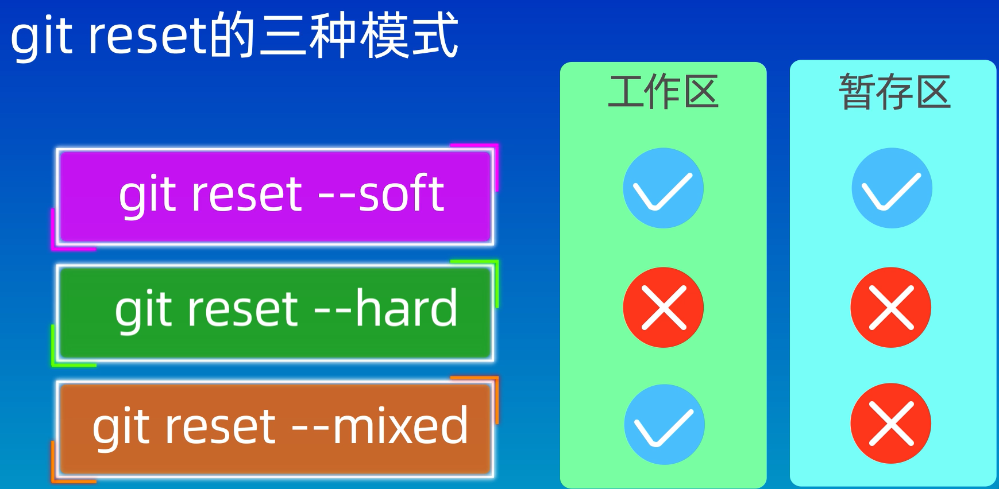
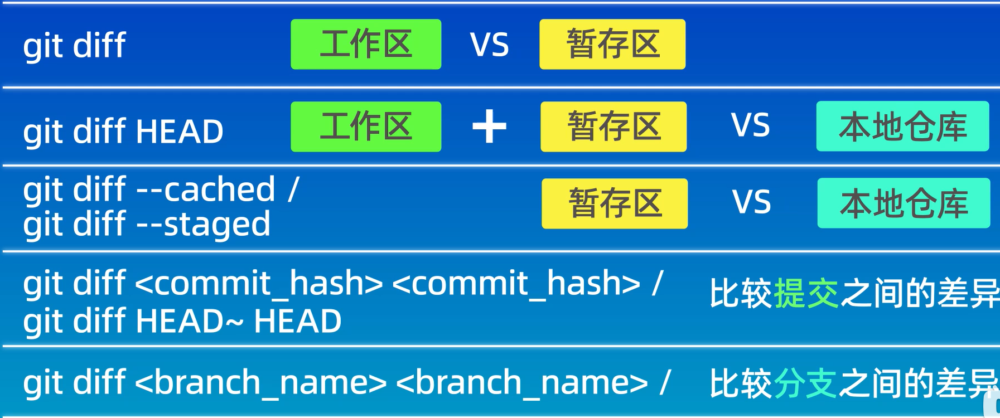

Git学习笔记： https://blog.csdn.net/qq_48092631/article/details/129661933


# 初始化示例

```sh
echo "# CBH-Study" >> README.md
git init
git add README.md
git commit -m "first commit"
git branch -M main
git remote add origin git@github.com:cbhcbhc/CBH-Study.git
git push -u origin main
```


# 命令操作

```sh
git status   					查看状态
git add .  /文件名     	  	  把文件添加到暂存区
git rm --cached 文件名    	  	  把文件从暂存区里面删除
git ls-files 查看暂存区的内容
ls 查看工作区的内容
git commit -m "日志信息"      	  添加到本地库
git commit -m "日志信息" 文件名    添加指定文件到本地库

git reflog 						查看历史记录
git log 					    查看版本详细信息
git log --oneline				一行查看版本信息
git reset --hard 版本号 		  版本穿梭
git reset HEAD~^  回退到上一个版本

git branch 分支名       创建分支
git branch -v 分支名    查看分支
git checkout 分支名     切换分支
git merge 分支名		 合并分支（合并前需要切换到主分支）
git branch -D 分支名	 删除分支
```


**远程仓库操作**

```sh
git remote -v  									查看当前所有远程地址别名
git remote add 远程仓库别名 远程地址 				给远程仓库起别名（给本地仓库创建远程仓库）
git push 远程仓库别名 本地分支：[远程分支]			  将本地分支推送到远程分支
git clone 远程仓库地址							将远程分支克隆到本地分支
git pull 远程仓库别名/地址名 分支名		


```


```sh
我们可以将远端和本地的分支进行绑定，绑定后就不需要指定分支名称了：
git push --set-upstream origin master:master
git push origin
```


# git reset

[06.git reset回退版本_哔哩哔哩_bilibili](https://www.bilibili.com/video/BV1HM411377j?p=6&vd_source=e0bc0019a69a665aa97f3d08221590b0)




# git diff




# git回退指定版本号，并提交到远程仓库

原文链接：https://blog.csdn.net/Liberty_yes/article/details/128713332


复制指定要回退的版本号
**一、 git本地版本回退**
git reset --hard commit_id(可用 git log -oneline 查看或git log查看)

git reset --hard daf5cfec176f7b4ab0f11912e84555ec01297e4e

**二、 git 远程版本回退**
git push origin HEAD --foce #远程提交回退

git push origin daf5cfec176f7b4ab0f11912e84555ec01297e4e --foce 

**三、或者本地回退版本,再提交到远程的方式**
git reset --hard HEAD

先本地回退到指定版本

git reset --hard daf5cfec176f7b4ab0f11912e84555ec01297e4e
1
再强制push到远程，让远程仓库和当前分支保持一致（假定当前分支为master）：

git push -f origin master 


# gitlab

自建代码托管平台

docker安装教程：https://blog.csdn.net/lianxiaohei/article/details/122665812


```sh
docker run -d  -p 8443:443 -p 8444:80 -p 8445:22 --name gitlab --restart always \
-v /root/dockerswarm/gitlab/etc:/etc/gitlab \
-v /root/dockerswarm/gitlab/log:/var/log/gitlab \
-v /root/dockerswarm/gitlab/data:/var/opt/gitlab --privileged=true twang2218/gitlab-ce-zh


# -d：后台运行
# -p：将容器内部端口向外映射
# --name：命名容器名称
# -v：将容器内数据文件夹或者日志、配置等文件夹挂载到宿主机指定目录
```


```sh
docker run 
-d                #后台运行，全称：detach
-p 8443:443      #将容器内部端口向外映射
-p 8090:80       #将容器内80端口映射至宿主机8090端口，这是访问gitlab的端口
-p 8022:22       #将容器内22端口映射至宿主机8022端口，这是访问ssh的端口
--restart always #容器自启动
--name gitlab    #设置容器名称为gitlab
-v /usr/local/gitlab/etc:/etc/gitlab    #将容器/etc/gitlab目录挂载到宿主机/usr/local/gitlab/etc目录下，若宿主机内此目录不存在将会自动创建
-v /usr/local/gitlab/log:/var/log/gitlab    #与上面一样
-v /usr/local/gitlab/data:/var/opt/gitlab   #与上面一样
--privileged=true         #让容器获取宿主机root权限
twang2218/gitlab-ce-zh    #镜像的名称，这里也可以写镜像ID

```

