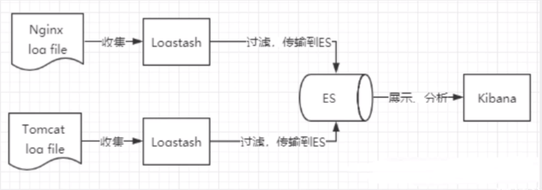
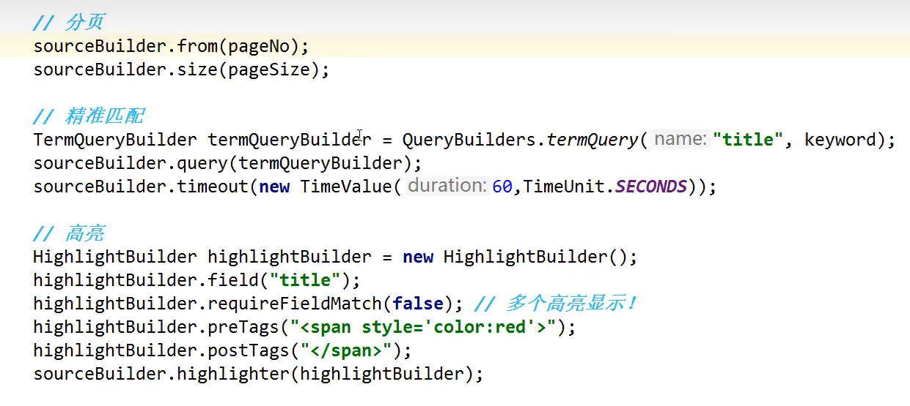

# es核心概念

**1.是什么？**

ElasticSearch 简称es,开源的分布式的全文搜索引擎，可以近乎实时的存储检索数据，es使用java开发，并且使用Lucene作为核心实现搜索功能。

**2.能干什么？**

分布式的搜索引擎，全文检索，数据分析引擎（分组聚合），对海量数据实时处理

**3.有什么特点？**

      快速搜索，分布式部署，可按照分数排序，restful所有操作可以通过http接口进行

（1）分布式的实时文档存储，每个字段都可以被搜索和索引

（2）分布式的实时文档搜索引擎

（3）胜任上百个服务节点的拓展，支持PB以上的结构化和非结构化数据

**4.使用场景？**

       搜索类场景，日志分析类场景（经典的ELK组合，可完成日志收集分析存储）5

**5.同类搜索对比？**

      同类的有Lucene,solr,ElasticSearch是目前主流的全文搜索方案，但是 Lucene 只是一个工具包，它不是一个完整的全文检索引擎。Lucene的目的是为软件开发人员提供一个简单易用的工具包，以方便的在目标系统中实现全文检索的功能，或者是以此为基础建立起完整的全文检索引擎。

目前以 Lucene 为基础建立的开源可用全文搜索引擎主要是 Solr 和 Elasticsearch。

Solr 和ElasticSearch都是基于Lucene实现的，**不同点**如下：

1.solr利用zookpper进行分布式管理，而ElasticSearch自身携带分布式协调管理功能

2.elasticSearch实时性更好

**相同点：**

底层都依赖Lucene，lucene能实现全文搜索因为实现了倒排索引的查询结构


**Elasticsearch是面向文档的，ES中的一切都是JSON**。关系型数据库 和 Elasticsearch对比：


**Mysql存数据：建库 – 建表 – 建行(对应具体数据) – 写入字段**

**ES存数据：建索引 – 建立types(慢慢被弃用) – 创建文档(对应具体数据)**


**物理设计：**

ES在后台把每个索引划分成多个分片，每个分片可在集群中不同的服务器之间迁移，他一个人就是一个集群，不存在单个的ES

**逻辑设计：**

一个索引类型包含多个文档：文档1、文档2.当索引一篇文档时，可通过这样的顺序找到他：索引 – 类型 – 文档ID，通过这个组合我们就能所引导某个具体的文档。


# **了解ELK**

- ELK是Elasticsearch、Logstash、 Kibana三大开源框架首字母大写简称,市面上也被成为Elastic Stack。
  - 其中Elasticsearch是一个基于Lucene、分布式、通过Restful方式进行交互的近实时搜索平台框架。
    - 像类似百度、谷歌这种大数据全文搜索引擎的场景都可以使用Elasticsearch作为底层支持框架，可见Elasticsearch提供的搜索能力确实强大,市面上很多时候我们简称Elasticsearch为es。
  - Logstash是ELK的中央数据流引擎,用于从不同目标(文件/数据存储/MQ )收集的不同格式数据,经过过滤后支持输出到不同目的地(文件/MQ/redis/elasticsearch/kafka等)。
  - Kibana可以将elasticsearch的数据通过友好的页面展示出来 ,提供实时分析的功能。
- 市面上很多开发只要提到ELK能够一致说出它是一个日志分析架构技术栈总称 ,但实际上ELK不仅仅适用于日志分析,它还可以支持其它任何数据分析和收集的场景,日志分析和收集只是更具有代表性。并非唯一性。

```
收集清洗数据(Logstash) ==> 搜索、存储(ElasticSearch) ==> 展示(Kibana)
```




# restful风格

**一种软件架构风格**,而不是标准,只是提供了一组设计原则和约束条件。它主要用于客户端和服务器交互类的软件。基于这个风格设计的软件可以**更简洁**，**更有层次**，**更易于实现缓存**等机制。

|      method      |                     url地址                     |          描述          |
| :--------------: | :---------------------------------------------: | :--------------------: |
| PUT（创建,修改） |     localhost:9200/索引名称/类型名称/文档id     | 创建文档（指定文档id） |
|   POST（创建）   |        localhost:9200/索引名称/类型名称         | 创建文档（随机文档id） |
|   POST（修改）   | localhost:9200/索引名称/类型名称/文档id/_update |        修改文档        |
|  DELETE（删除）  |     localhost:9200/索引名称/类型名称/文档id     |        删除文档        |
|   GET（查询）    |     localhost:9200/索引名称/类型名称/文档id     |   查询文档通过文档ID   |
|   POST（查询）   | localhost:9200/索引名称/类型名称/文档id/_search |      查询所有数据      |


# 字段数据类型

- 字符串类型
  - text、keyword
    - text：支持分词，全文检索,支持模糊、精确查询,不支持聚合,排序操作;text类型的最大支持的字符长度无限制,适合大字段存储；
    - keyword：不进行分词，直接索引、支持模糊、支持精确匹配，支持聚合、排序操作。keyword类型的最大支持的长度为——32766个UTF-8类型的字符,可以通过设置ignore_above指定自持字符长度，超过给定长度后的数据将不被索引，无法通过term精确匹配检索返回结果。
- 数值型
  - long、Integer、short、byte、double、float、**half float**、**scaled float**
- 日期类型
  - date
- 布尔类型
  - boolean
- 二进制类型
  - binary
- 等等…


# 集成SpringBoot

狂神笔记： https://www.dgrt.cn/a/2150842.html?action=onClick

其他参考api: https://luzhenyu.blog.csdn.net/article/details/123411411

es版本控制:需要自定义es版本依赖，需要和本地保持一致

```xml
<properties>
    <java.version>1.8</java.version>
    <elasticsearch.version>7.6.2</elasticsearch.version>
</properties>
```

pom.xml

```xml
<dependency>
    <groupId>org.springframework.boot</groupId>
    <artifactId>spring-boot-starter-data-elasticsearch</artifactId>
</dependency>
```


配置es连接信息：集群就配置多个，单机配置一个就行




