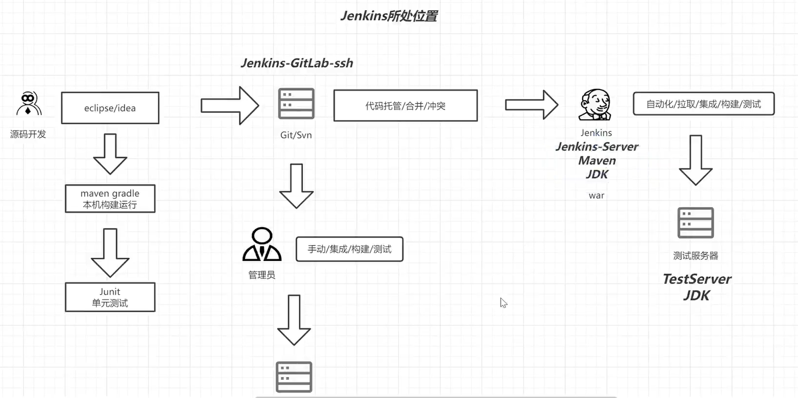

学习笔记链接： https://blog.csdn.net/qq_52030824/article/details/127621660

docker安装教程： https://www.cnblogs.com/fuzongle/p/12834080.html      [(78条消息) Docker + Jenkins 详细安装步骤_docker jenkins_一分_耕耘的博客-CSDN博客](https://blog.csdn.net/weixin_69556593/article/details/130606248)




```sh
docker run -d -p 8440:8080 -p 50000:50000 -v /root/dockerswarm/jenkins/jenkins_mount:/var/jenkins_home -v /etc/localtime:/etc/localtime --name jenkins jenkins/jenkins
```

