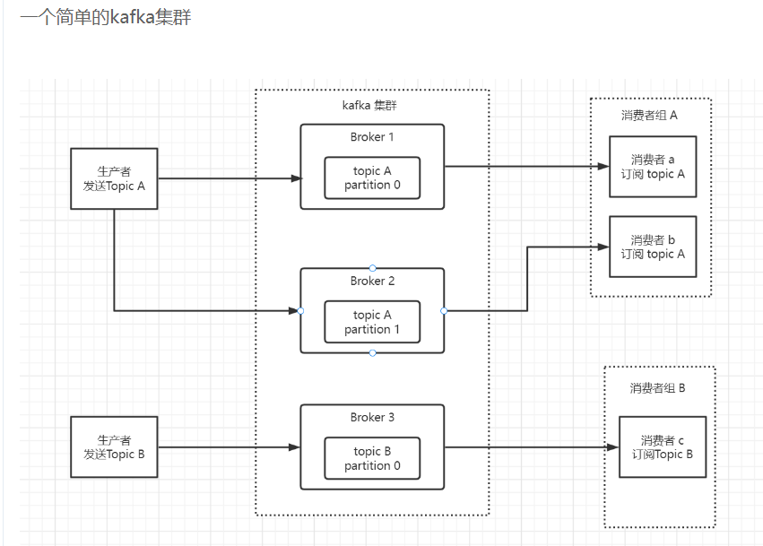

# 1 kafka介绍

千峰教育kafka笔记： https://blog.csdn.net/qq_28742063/article/details/126886615

kafka 是一款基于发布与订阅的消息系统，是一个**高性能、高可用和高扩展**的消息队列

Kafka是最初由Linkedin公司开发，是⼀个分布式、⽀持分区的（partition）、多副本的 （replica），基于zookeeper协调的分布式消息系统，它的最⼤的特性就是可以实时的处理 ⼤量数据以满⾜各种需求场景：⽐如基于hadoop的批处理系统、低延迟的实时系统、 Storm/Spark流式处理引擎，web/nginx⽇志、访问⽇志，消息服务等等，⽤scala语⾔编 写，Linkedin于2010年贡献给了Apache基⾦会并成为顶级开源 项⽬。


使用场景：

⽇志收集：⼀个公司可以⽤Kafka收集各种服务的log，通过kafka以统⼀接⼝服务的⽅式 开放给各种consumer，例如hadoop、Hbase、Solr等。 

消息系统：解耦和⽣产者和消费者、缓存消息等。

 ⽤户活动跟踪：Kafka经常被⽤来记录web⽤户或者app⽤户的各种活动，如浏览⽹⻚、 搜索、点击等活动，这些活动信息被各个服务器发布到kafka的topic中，然后订阅者通过 订阅这些topic来做实时的监控分析，或者装载到hadoop、数据仓库中做离线分析和挖 掘。

 运营指标：Kafka也经常⽤来记录运营监控数据。包括收集各种分布式应⽤的数据，⽣产 各种操作的集中反馈，⽐如报警和报告。


# 2 关键词介绍

| 名词          | 解释                                                         |
| ------------- | ------------------------------------------------------------ |
| broker        | 消息系统处理的一个节点，一个kafka服务器被称为一个broker,多个broker被称为kafka集群 |
| topic         | 主题，kafka中的消息归类，相当于mysql的表。发布到kafka的每条消息都要有topic |
| partition     | 分区，每个topic由多个partition组成，相当于mysql的分区表，partition是消息物理上的集合，topic是逻辑集合。 |
| producer      | 消息生产者，发送消息的客户端                                 |
| consumer      | 消息消费者，消费消息的客户端                                 |
| offset        | 偏移量，记录消费者消费到哪里了。保存在zk上或者kafka上        |
| consumerGroup | 消费者组，每个消费者都属于一个consumerGroup,多个消费者可以组成一个group,同一个组的消费者只能消费一条topic消息，不同组可以重复消费同一条消息，比如对于创建订单消息，A 系统可消费，B系统也可以消费，互相之前不影响。 |


 **Controller Broker**

  在分布式系统中，通常需要有一个协调者，该协调者会在分布式系统发生异常时发挥特殊的作用。在Kafka中该协调者称之为控制器(Controller),其实该控制器并没有什么特殊之处，它本身也是一个普通的Broker，只不过需要负责一些额外的工作(追踪集群中的其他Broker，并在合适的时候处理新加入的和失败的Broker节点、Rebalance分区、分配新的leader分区等)。值得注意的是：Kafka集群中始终只有一个Controller Broker。


Controller Broker的主要职责有很多，主要是一些管理行为，主要包括以下几个方面：

- 创建、删除主题，增加分区并分配leader分区
- 集群Broker管理（新增 Broker、Broker 主动关闭、Broker 故障)
- partition leader选举
- 分区重分配




# 3 **topic 和 partition**

==topic无序，partition有序==

topic是什么概念？topic可以实现消息的分类，不同消费者订阅不同的topic。

 kafka的消息是通过**topic**进行分类的，相当于数据库的表，一类业务的数据集合。topic可以被分成若干个**分区**，消息以追加的方式写入分区，然后以先进先出的方式顺序读取

注意一个topic包含多个分区，因此无法保持消息的整体顺序性，只能保证单个分区的有序性。多分区设计可以提高程序性能。在我们的流量变大的时候，我们可以增加分区数来提高性能。


消费者在消费分区里面的消息的时候，会有一个offset来记录消费到哪里了，这里有同学会有疑问，最新加入的消费者应该从哪里消费了，有参数可以控制从哪里开始消费

   \#earliest
   \#当各分区下有已提交的offset时，从提交的offset开始消费；无提交的offset时，从头开始消费
   \#latest
   \#当各分区下有已提交的offset时，从提交的offset开始消费；无提交的offset时，消费新产生的该分区下的数据

   auto-offset-reset: earliest


# 4 生产者消费者细节

往队列中发送数据的称为**生产者producer**，从队列中拿取数据的称为**消费者Consumer**。根据不同的业务需求，我们肯定需要有多个不同的队列，其中每一个队列称为一个**topic（主题）**。

![[外链图片转存失败,源站可能有防盗链机制,建议将图片保存下来直接上传(img-PQ9RHrrP-1660806112053)(E:/Blog/lansg/source/img/image-20220817092207084.png)]](kafka.assets/023b1394c9554dc3b4fb0e06f9155b75-16851770113646.png)

可以多个生产者往一个[topic](https://so.csdn.net/so/search?q=topic&spm=1001.2101.3001.7020)里面发送数据，也可以有多个消费者从一个topic里面拿取数据。

![[外链图片转存失败,源站可能有防盗链机制,建议将图片保存下来直接上传(img-c2pzlREx-1660806112054)(E:/Blog/lansg/source/img/image-20220817092428664.png)]](kafka.assets/fe77d777275548098aab61a262d719a3-16851770316469.png)

既然kafka是高可用的，那么把海量的数据放在一台主机上肯定是不行的，如果这台主机宕机了怎么办？

我们对比联想一下数据库和缓存是如何解决这个问题的：

在数据库设计中，当单表的数据量达到几千万或者上亿时，我们会将它拆分成多个库或者多张表；
在缓存设计中，我们通过redis cluster将主节点分片，从而解决单机瓶颈的问题；
kafka同样采取了这种水平拆分的思想，它将每一个topic中的数据拆分为多个partition（分区），每一个partition分布在不同的kafka实例上，构成kafka集群，所有partition中的数据合集就是全部的数据。当生产者发送数据时，实际上是发送到了topic中的partition里，同样消费者也是从partition中拿取数据进行消费。其中一个kafka实例也称为一个broker。
![[外链图片转存失败,源站可能有防盗链机制,建议将图片保存下来直接上传(img-h1xAIoUZ-1660806112055)(E:/Blog/lansg/source/img/image-20220817095658785.png)]](kafka.assets/f45805ef5761451aad043aceb679cfc2.png)


这样将数据分布在不同的broker上，即使一台broker宕机了，其他的broker依然能够提供服务。但是你有没有发现，由于不同的partition存放的是不同的数据，那肯定要对数据进行持久化，不然数据丢了怎么办。

kafka是将partition的数据写在磁盘的(消息日志)，不过Kafka只允许追加写入(顺序访问)，避免缓慢的随机 I/O 操作。但是kafka也不是partition一有数据就立马将数据写到磁盘上，它会先缓存一部分，等到足够多数据量或等待一定的时间再批量写入(flush)。

但是还有一个问题，要是某一个broker在对数据进行持久化之前就宕机了，那该部分数据不是还是会丢失？

事实上，kafka会在不同的broker上对该broker的partition进行备份，就像这样：
![[外链图片转存失败,源站可能有防盗链机制,建议将图片保存下来直接上传(img-E0YWtw7S-1660806112055)(E:/Blog/lansg/source/img/image-20220817101916144.png)]](kafka.assets/5c64d8574aa14994aaa2806f51ce3871.png)

每个broker中有自己的主分区和别的broker的备份分区。只有主分区对外提供服务，备份分区仅用于备份，不进行读写。当某个broker宕机时，会从其他broker上的备份分区选举出主分区提供服务。

现在基本完成了消息存储的高可用，为了提高吞吐量，保证消息消费的效率，kafka提出了消费者组consumer group的概念。

还记得上文所说的同一个topic可以被多个消费者消费吗？在没有引入消费者组的情况下，如上图所示，消费者1独自消费partition0、partition1、partition2中的数据，引入消费者组后，组中的每一个消费者消费一个partition的数据。
![[外链图片转存失败,源站可能有防盗链机制,建议将图片保存下来直接上传(img-js64Uy2a-1660806112056)(E:/Blog/lansg/source/img/image-20220817104159950.png)]](https://img-blog.csdnimg.cn/ce48ea5ad98f435c96d62a045b8bfe9a.png)

此外，Kafka 限定了每个 partition 只能由消费组中的一个消费者进行消费，消费者组中的每一个消费者只能消费一个partition（一对一的关系）。

如果消费者组中某个消费者宕机了，那么剩下的消费者中，某一个可能要消费两个partition；
如果只有三个partition，而消费者组中有四个消费者，那么有一个消费者会空闲；
消费者组之间逻辑是独立的。上图中如果新增加一个消费者组，那么它仍然可以消费topic1中的全部数据。

现在假设消费者1宕机了，那么消费者2和消费者3会有一个消费者消费两个partition，但是该消费者如何知道消费者1的消费进度呢？
这就要提到offset了。每个消费者都有自己的offset，它表示该消费者的消费进度，每次消费者进行消费的时候，都会提交这个offset，可以选择手动提交或者自动提交。


在以前版本的Kafka，这个offset是由Zookeeper来管理的，后来Kafka开发者认为Zookeeper不合适大量的删改操作，于是把offset在broker以内部topic(__consumer_offsets)的方式来保存起来。但是kafka对于zookeeper还是有重要依赖的，zk为kafka提供了但不限于以下服务：

探测broker和consumer的添加或移除；
负责维护所有partition的领导者/从属者关系（主分区和备份分区），如果主分区挂了，需要选举出备份分区作为主分区；
维护topic、partition等元配置信息
…


# 5 生产者消息发送

## 5.1 消息同步发送

⽣产者同步发消息，在收到kafka的ack告知发送成功之前⼀直处于阻塞状态


在同步发消息的场景下：⽣产者发动broker上后，ack会有3种不同的选择：

（1）acks=0： 表示producer不需要等待任何broker确认收到消息的回复，就可以继续发送下 ⼀条消息。性能最⾼，但是最容易丢消息。 

（2）acks=1： ⾄少要等待leader已经成功将数据写⼊本地log，但是不需要等待所有 follower是否成功写⼊。就可以继续发送下⼀ 条消息。这种情况下，如果follower没有成功备份数据，⽽此时leader⼜挂 掉，则消息会丢失。 

（3）acks=-1或all： 需要等待 min.insync.replicas(默认为1，推荐配置⼤于等于2) 这 个参数配置的副本个数都成功写⼊⽇志，这种策略会保证只要有⼀个备份存活就不会丢失数据。这 是最强的数据保证。⼀般除⾮是⾦融级别，或跟钱打交道的场景才会使⽤这种配置。


## 5.2 消息异步发送

⽣产者发消息，发送完后不⽤等待broker给回复，直接执⾏下⾯的业务逻辑。可以提供 callback，让broker异步的调⽤callback，告知⽣产者，消息发送的结果


# 6 消费者消费消息


## 6.1 自动提交offset

设置⾃动提交参数 - 默认

```java
// 是否⾃动提交offset，默认就是true
props.put(ConsumerConfig.ENABLE_AUTO_COMMIT_CONFIG, "true");
// ⾃动提交offset的间隔时间
props.put(ConsumerConfig.AUTO_COMMIT_INTERVAL_MS_CONFIG, "1000");
```

消费者poll到消息后默认情况下，会⾃动向broker的_consumer_offsets主题提交当前主题-分 区消费的偏移量。 

**⾃动提交会丢消息**：因为如果消费者还没消费完poll下来的消息就⾃动提交了偏移量，那么此 时消费者挂了，于是下⼀个消费者会从已提交的offset的下⼀个位置开始消费消息。之前未被 消费的消息就丢失掉了。


## 6.2 手动提交offset

​	手动提交offset分为手动同步提交和手动异步提交

```java
 ⼿动同步提交offset，当前线程会阻塞直到offset提交成功
 ⼀般使⽤同步提交，因为提交之后⼀般也没有什么逻辑代码了
```


# 7 SpringBoot中使用kafka

1 引入依赖

```xml
<dependency>
 <groupId>org.springframework.kafka</groupId>
 <artifactId>spring-kafka</artifactId>
 </dependency>
```


2 编写配置文件 application.yml

```yml
server:
  port: 8080

spring:
  kafka:
    bootstrap-servers: 192.168.0.131:9092 # Kafka集群地址 (broker节点地址)
    producer: # 生产者
      retries: 3 # 重试次数
      batch-size: 16384 # 每次拉取缓冲区中16kb数据发送到broker
      buffer-memory: 33554432 # 缓冲区大小32MB
      acks: 1 # 默认值为1 （多副本之间的leader收到消息，并写入到本地log中，返回ack给生产者）
      # 指定消息key和消息体的编解码方式
      key-serializer: org.apache.kafka.common.serialization.StringSerializer
      value-serializer: org.apache.kafka.common.serialization.StringSerializer
    consumer: # 消费者
      group-id: default-group # 消费组id
      enable-auto-commit: false # 手动提交offset（即先消费，再提交offset）
      auto-offset-reset: earliest # 第一次消费会从最开始的位置消费，之后消费新消息
      key-serializer: org.apache.kafka.common.serialization.StringSerializer
      value-serializer: org.apache.kafka.common.serialization.StringSerializer
      max-poll-records: 500 # 一次最多拉取500条消息
    listener:
      # RECORD -- 每一条记录被消费者监听器处理后提交
      # BATCH -- 每一批poll()的数据被消费者监听器处理后提交
      # TIME -- 每一批poll()的数据被消费者监听器处理之后，距离上次提交的时间大于TIME时提交
      # COUNT -- 每一批poll()的数据被消费者监听器处理之后，被处理的record数量大于等于COUNT时提交
      # COUNT_TIME -- COUNT | TIME 有一个条件满足时提交
      # MANUAL -- 每一批poll()的数据被消费者监听器处理之后，手动调用Acknowledgment.acknowledge()后提交
      # MANUAL_IMMEDIATE -- 手动调用Acknowledgment.acknowledge()后立即提交，一般使用这种
      ack-mode: MANUAL_IMMEDIATE


```


3 编写生产者

```java
@RestController
@RequestMapping("/msg")
public class KafkaController {

    private final static String TOPIC_NAME = "my-replicated-topic";

    @Resource
    private KafkaTemplate<String, String> kafkaTemplate;

    @RequestMapping("/send")
    public String sendMessage(){
        kafkaTemplate.send(TOPIC_NAME, "key", "this is a message!");
        return "send success!";
    }
}

```


4. 编写消费者

```java
@Component
public class MyConsumer {
    @KafkaListener(topics = "my-replicated-topic", groupId = "MyGroup1")
    public void listenGroup(ConsumerRecord<String, String> record, Acknowledgment ack){
        String value = record.value();
        System.out.println(value);
        System.out.println(record);
        ack.acknowledge(); // 手动提交offset（如果没有设置手动提交offset，消息会被重复消费）
    }
}

```


注意：消费者中配置消息主题、分区、偏移量

```java
@KafkaListener(groupId = "testGroup", topicPartitions = {
    @TopicPartition(topic = "topic1", partitions = {"0", "1"}), // 指定消费topic1下的0，1分区
    // 指定消费topic2下的0分区，从offset+1开始消费；消费topic2下的1分区，指定从offset为100的位置开始消费
    @TopicPartition(topic = "topic2", partitions = "0", partitionOffsets = @PartitionOffset(partition = "1", initialOffset = "100"))
})
public void listenGroup2(ConsumerRecord<String, String> record, Acknowledgment ack){
    String value = record.value();
    System.out.println(value);
    System.out.println(record);
    ack.acknowledge(); // 手动提交offset（如果没有设置手动提交offset，消息会被重复消费）
}

```


# 8 Kafka集群中controller、rebalance、HW

## controller

由于kafka集群是一个分布式系统，需要有一个协调者，controller就是Kafka集群中的协调者。它本身也是一个broker，只不过负责了一个额外的工作。

集群中谁来充当controller？

每个broker启动时会向zk创建一个临时序号节点，最先在zookeeper上创建临时节点成功的broker将会作为集群中的controller。

controller重度依赖zk，依赖zk保存元数据、进行服务发现。controller大量使用watch功能实现对集群的协调管理，主要负责这么几件事：

当集群中有一个副本的leader挂掉，需要在集群中选举出一个新的leader，选举的规则是从isr集合中最左边获得

当集群中有broker新增或减少，controller会同步信息给其他broker

当集群中有分区新增或减少，controller会同步信息给其他broker

如果controller所在的broker发生了故障，kafka集群就必须选举出一个新的controller。
这里存在一个问题：很难确定broker是宕机了还是暂时故障？但是为了集群的正常运行，必须选举出一个新的controller，如果之前故障的controller又恢复正常了，不知道自己已经被更换，那么集群中就出现了两个controller，这就是脑裂问题。

**脑裂现象：简单描述，就是在分布式系统环境下，由于网络或者其他原因导致master出现假死，这时会触发系统进行新的master选举，此时系统中就会出现两个master，产生一系列问题。**

Kafka是通过使用epoch number来处理脑裂问题的
epoch number只是一个单调递增的数。第一次选择controller时，epoch number值为1。如果再次选择新的controller，epoch number为2，依次单调递增。

每个新选举出的controller通过zookeeper的条件递增操作获得一个新的更大的epoch number，当其他broker知道当前controller的epoch number时，如果他们从controller收到包含旧（较小）epoch number的消息，则会忽略这些消息。即broker根据最大的epoch number来区分谁是最新的Controller。

## rebalance机制

前提：消费组中的消费者没有指明分区来消费
触发条件：当消费组中的消费者和分区的关系发生变化的时候
分区分配策略：在rebalance之前，分区怎么分配会有三种策略：
range：根据公式计算得到每个消费者消费哪几个分区（前面的消费者消费分区数=分区总数/消费者数量+1；后面的消费者消费分区数=分区总数/消费者数量）
轮询：大家轮着来（如果有消费者挂掉，重新轮询，之前的分配关系会被打乱）
sticky：粘合策略，如果需要rebalance，会在之前已分配的基础上调整，不会改变之前的分配情况，如果这个策略没有开，那么就要进行全部的重新分配。建议开启

## HW和LEO

LEO是某个副本最后的消息位置（log-end-offset）
HW是已完成同步的位置。消息在写入broker，且每个broker完成这条消息的同步后，HM才会变化。在这之前消费者是消费不到这条消息的。在同步完成之后，HW更新之后，消费者才能消费到这条消息，这样的目的是为防止消息的丢失。

LEO（Log End Offset）：标识当前日志文件中下一条待写入的消息的 offset
HW（High Watermark）：高水位，它标识了一个特定的消息偏移量 offset（此水位之上的消息已被所有副本同步，可以安全消费），消费者只能拉取到这个水位 offset 之前的消息

