# RabbitMQ讲义

**引言：**

**中国被世界黑的最惨的一天**

2007年10月30日，北京奥运会门票面向境内公众第二阶段预售正式启动。上午一开始，公众提交申请空前踊跃。上午9时至10时，官方票务网站的浏览量达到了**800万次**，票务呼叫中心热线从9时至10时的呼入量超过了**380万**人次。由于瞬间访问数量过大，技术系统应对不畅，造成很多申购者无法及时提交申请，为此北 京奥组委票务中心对广大公众未能及时、便捷地实现奥运门票预订表示歉意。

**一个神奇的网站**

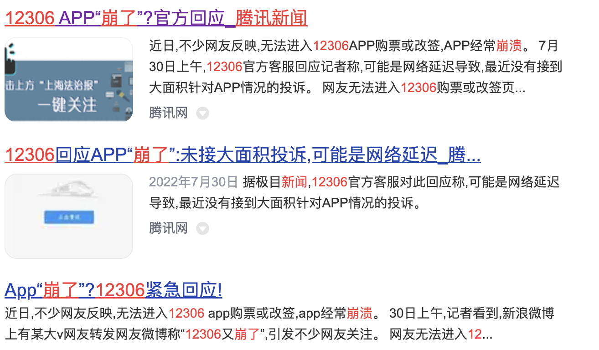

**大型翻车现场**

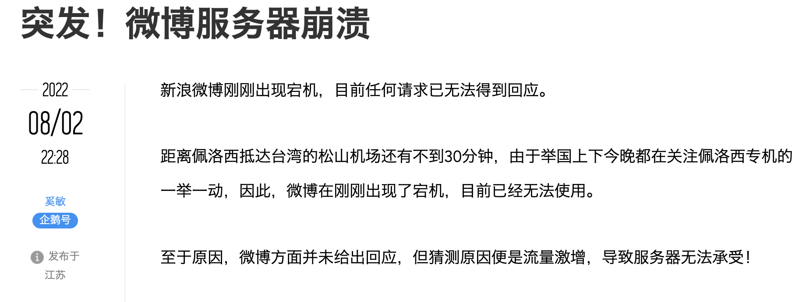

问题现象： 

1、 海量数据

2、 高并发

解决方案：其中最为代表解决方案流量削峰-》 使用MQ

## 1、 MQ概念

### 1.1 MQ 介绍


MQ（Message Queue）消息队列，是基础数据结构中“先进先出”的一种数据结构。一般用来解决应用解耦，异步消息，流量削峰等问题，实现高性能，高可用，可伸缩和最终一致性架构。

### 1.2 MQ应用场景

**MQ的优势**

#### **1.2.1异步解耦**

以电商应用为例，应用中有订单系统、库存系统、物流系统、支付系统。用户创建订单后，如果耦合 调用库存系统、物流系统、支付系统，任何一个子系统出了故障，都会造成下单操作异常。当转变成基于消息队列的方式后，系统间调用的问题会减少很多，比如物流系统因为发生故障，需要几分钟来修复。在 这几分钟的时间里，物流系统要处理的内存被缓存在消息队列中，用户的下单操作可以正常完成。当物流 系统恢复后，继续处理订单信息即可，中单用户感受不到物流系统的故障，提升系统的可用性。

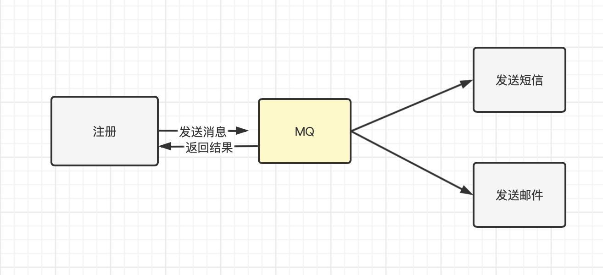

#### **1.2.2 削峰填谷**

举个例子，如果订单系统最多能处理一万次订单，这个处理能力应付正常时段的下单时绰绰有余，正 常时段我们下单一秒后就能返回结果。但是在高峰期，如果有两万次下单操作系统是处理不了的，只能限 制订单超过一万后不允许用户下单。使用消息队列做缓冲，我们可以取消这个限制，把一秒内下的订单分 散成一段时间来处理，这时有些用户可能在下单十几秒后才能收到下单成功的操作，但是比不能下单的体 验要好。 

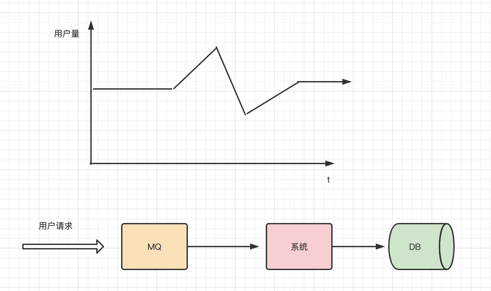

#### 1.2.3 消息分发

在实际开发中一个系统的数据有的时候需要分发个不同的系统中， 拿电商举例在双11的时候有很多会场，每一个会场可能都需要用到一个商品的数据，那么我们需要把数据分发到不同的会场中，假设有加了一个会场我们还需要把数据分发给新的会场

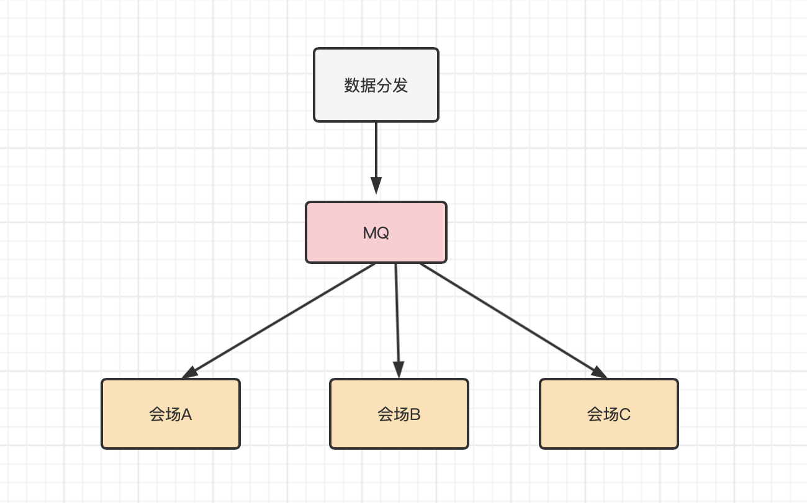

**MQ的劣势**

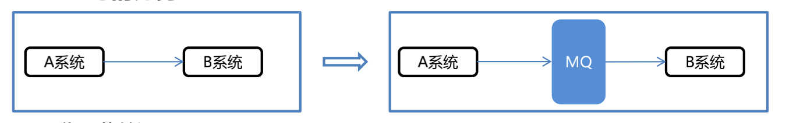

**系统可用性降低** 

系统引入的外部依赖越多，系统稳定性越差。一旦 MQ 宕机，就会对业务造成影响。如何保证MQ的高可用？ 

 **系统复杂度提高** 

MQ 的加入大大增加了系统的复杂度，以前系统间是同步的远程调用，现在是通过 MQ 进行异步调用。如何保证消息没有被重复消费？怎么处理消息丢失情况？那么保证消息传递的顺序性？ 

 **一致性问题** 

A 系统处理完业务，通过 MQ 给B、C、D三个系统发消息数据，如果 B 系统、C 系统处理成功，D 系统处理失败。如何保证消息数据处理的一致性？ 

### 1.3 常见的消息中间件

目前市场上主流的消息中间件主要有ActivitiMQ、RabbitMQ、RocketMQ、kafka

**ActivitiMQ**:ActiveMQ是Apache出品,比较老的一个开源的消息中间件, 是一个完全支持JMS规范的消息中间件.API丰富,以前在中小企业应用广泛

MQ衡量的指标:服务性能,数据存储,集群架构

**RabbitMQ:** RabbitMQ 是一个由 Erlang 语言开发的 AMQP 的开源实现。

AMQP ：Advanced Message Queue，高级消息队列协议。它是应用层协议的一个开放标准，为面向消息的中间件设计，基于此协议的客户端与消息中间件可传递消息，并不受产品、开发语言等条件的限制。

RabbitMQ 最初起源于金融系统，用于在分布式系统中存储转发消息，在易用性、扩展性、高可用性等方面表现不俗。

对数据的一致性,稳定性和可靠性要求比较高的场景

**RocketMQ:** RocketMQ 是阿里巴巴在 2012 年开源的分布式消息中间件，目前已经捐赠给 Apache 软件基金会，并于 2017 年 9 月 25 日成为 Apache 的顶级项目。作为经历过多次阿里巴巴双十一这种“超级工程”的洗礼并有稳定出色表现的国产中间件，以其高性能、低延时和高可靠等特性近年来已经也被越来越多的国内企业使用。

**Kafka: **Kafka是由Apache软件基金会开发的一个开源流处理平台，由Scala和Java编写。Kafka是一种高吞吐量的分布式发布订阅消息系统，它可以处理消费者规模的网站中的所有动作流数据。 这种动作（网页浏览，搜索和其他用户的行动）是在现代网络上的许多社会功能的一个关键因素。 这些数据通常是由于吞吐量的要求而通过处理日志和日志聚合来解决。 对于像Hadoop一样的日志数据和离线分析系统，但又要求实时处理的限制，这是一个可行的解决方案。Kafka的目的是通过Hadoop的并行加载机制来统一线上和离线的消息处理，也是为了通过集群来提供实时的消息。

**常见消息中间件对比图**

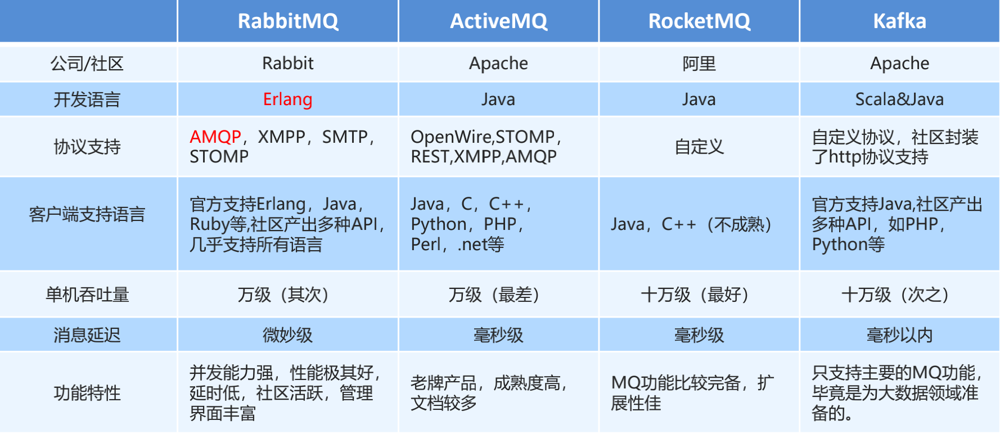

### 1.4 RabbitMQ简介

AMQP，即 Advanced Message Queuing Protocol（高级消息队列协议），是一个网络协议，是应用层协议 的一个开放标准，为面向消息的中间件设计。基于此协议的客户端与消息中间件可传递消息，并不受客户端/中 间件不同产品，不同的开发语言等条件的限制。2006年，AMQP 规范发布。类比HTTP。

2007年，Rabbit 技术公司基于 AMQP 标准开发的 RabbitMQ 1.0 发布。RabbitMQ 采用 Erlang 语言开发。 Erlang 语言由 Ericson 设计，专门为开发高并发和分布式系统的一种语言，在电信领域使用广泛。

### 1.5 RabbitMQ中的核心概念

 **Broker**：接收和分发消息的应用，RabbitMQ Server就是 Message Broker 

 **Virtual host**：出于多租户和安全因素设计的，把 AMQP 的基本组件划分到一个虚拟的分组中，类似于网 络中的 namespace 概念。当多个不同的用户使用同一个 RabbitMQ server 提供的服务时，可以划分出多个vhost，每个用户在自己的 vhost 创建 exchange／queue 等 

**Connection**：publisher／consumer 和 broker 之间的 TCP 连接 

**Channel**：如果每一次访问 RabbitMQ 都建立一个 Connection，在消息量大的时候建立 TCP Connection 的开销将是巨大的，效率也较低。Channel 是在 connection 内部建立的逻辑连接，如果应用程序支持多线 程，通常每个thread创建单独的 channel 进行通讯，AMQP method 包含了channel id 帮助客户端和 message broker 识别 channel，所以 channel 之间是完全隔离的。Channel 作为轻量级的 Connection  极大减少了操作系统建立 TCP connection 的开销

 **Exchange**：message 到达 broker 的第一站，根据分发规则，匹配查询表中的 routing key，分发消息到 queue 中去。常用的类型有：direct (point-to-point), topic (publish-subscribe) and fanout (multicast) 

**Queue**：消息最终被送到这里等待 consumer 取走 

**Binding**：exchange 和 queue 之间的虚拟连接，binding 中可以包含 routing key。Binding 信息被保存 到 exchange 中的查询表中，用于 message 的分发依据

**RabbitMQ架构图**

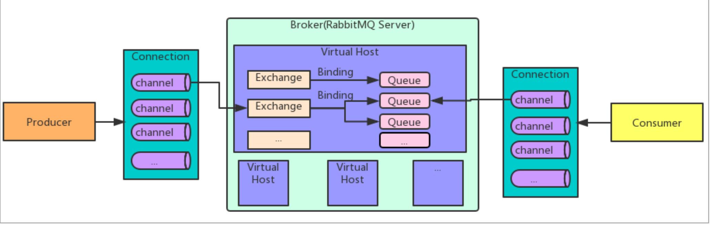

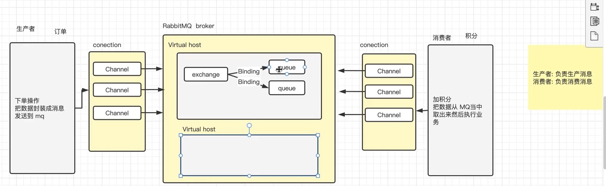

## 2、RabbitMQ的安装与配置

docker安装教程：https://blog.csdn.net/weixin_51113611/article/details/125129613

```sh
docker run -d --hostname myrabbitmq --name rabbitmq -p 15672:15672 -p 5672:5672 rabbitmq
通过docker ps -a查看部署的mq容器id，在通过 docker exec -it 容器id /bin/bash 进入容器内部在
运行：rabbitmq-plugins enable rabbitmq_management  #消息延迟插件
```


部署成功后进入控制台点击channel会出现以下错误`Stats in management UI are disabled on this node`

解决办法： https://blog.csdn.net/qq_41169544/article/details/125496223

```sh
#进入rabbitmq容器
docker exec -it {rabbitmq容器名称或者id} /bin/bash
 
#进入容器后，cd到以下路径
cd /etc/rabbitmq/conf.d/
 
#修改 management_agent.disable_metrics_collector = false
echo management_agent.disable_metrics_collector = false > management_agent.disable_metrics_collector.conf
 
#退出容器
exit
 
#重启rabbitmq容器
docker restart {rabbitmq容器id或容器名称}
```


## 3、RabbitMQ的快速入门

RabbitMQ 提供了 6 种工作模式：简单模式、work queues、Publish/Subscribe 发布与订阅模式、Routing 路由模式、Topics 主题模式、RPC 远程调用模式（远程调用，不太算 MQ；暂不作介绍）。 

官网： https://www.rabbitmq.com/getstarted.html

入门需求： 利用生产者发送消息到MQ ,消费者消费消息

操作步骤：

- 创建生产者工程和消费者工程
- 添加依赖

```xml
<dependencies>
        <dependency>
           <groupId>com.rabbitmq</groupId>
            <artifactId>amqp-client</artifactId>
            <version>5.6.0</version>
        </dependency>
</dependencies>
```

- 编写生产者

```java
package cn.wolfcode.java.rabbitmq._01helloworld;
import com.rabbitmq.client.Channel;
import com.rabbitmq.client.Connection;
import com.rabbitmq.client.ConnectionFactory;
/**
 * Created by wolfcode-fanjialong
 */
public class Send {
    private final static String QUEUE_NAME = "hello";
    public static void main(String[] argv) throws Exception {
        ConnectionFactory factory = new ConnectionFactory();
        factory.setHost("192.168.142.129");
        try (Connection connection = factory.newConnection();
             Channel channel = connection.createChannel()) {
           /**
             * 声明队列
             * 第一个参数queue：队列名称
             * 第二个参数durable：是否持久化
             * 第三个参数Exclusive：排他队列，如果一个队列被声明为排他队列，该队列仅对首次
声明它的连接可见，并在连接断开时自动删除。
             *     这里需要注意三点：
             *         1. 排他队列是基于连接可见的，同一连接的不同通道是可以同时访问同一个
连接创建的排他队列的。
             *         2. "首次"，如果一个连接已经声明了一个排他队列，其他连接是不允许建
立同名的排他队列的，这个与普通队列不同。
             *         3. 即使该队列是持久化的，一旦连接关闭或者客户端退出，该排他队列都会
被自动删除的。
             *         这种队列适用于只限于一个客户端发送读取消息的应用场景。
             * 第四个参数Auto-delete：自动删除，如果该队列没有任何订阅的消费者的话，该队列
会被自动删除。
             *                         这种队列适用于临时队列。
             */
            channel.queueDeclare(QUEUE_NAME, false, false, false, null);
            String message = "Hello World!";
            channel.basicPublish("", QUEUE_NAME, null, message.getBytes("UTF-8"));
            System.out.println(" [x] Sent '" + message + "'");
        }
    }
}
```

- 编写消费者

```java
package cn.wolfcode.java.rabbitmq._01helloworld;
import com.rabbitmq.client.Channel;
import com.rabbitmq.client.Connection;
import com.rabbitmq.client.ConnectionFactory;
import com.rabbitmq.client.DeliverCallback;
/**
 * Created by wolfcode-fanjialong
 */
public class Recv {
    private final static String QUEUE_NAME = "hello";
    public static void main(String[] argv) throws Exception {
        ConnectionFactory factory = new ConnectionFactory();
        factory.setHost("192.168.142.129");
        Connection connection = factory.newConnection();
        Channel channel = connection.createChannel();
        channel.queueDeclare(QUEUE_NAME, false, false, false, null);
        System.out.println(" [*] Waiting for messages. To exit press CTRL+C");
        DeliverCallback deliverCallback = (consumerTag, delivery) -> {
            String message = new String(delivery.getBody(), "UTF-8");
            System.out.println(" [x] Received '" + message + "'");
        };
        channel.basicConsume(QUEUE_NAME, true, deliverCallback, consumerTag -> { });

    }

}
```

## 4、RabbitMQ的常见工作模式

### **4.1 Work queues 工作队列模式**

#### **4.1.1 模式说明**

通过Helloworld工程我们已经能够构建一个简单的消息队列的基本项目，项目中存在几个角色:生产 者、消费者、队列，而对于我们真实的开发中  ，对于消息的消费者通过是有多个的。

比如在实现用户注册功能时，用户注册成功，会给响对应用户发送邮件，同时给用户发送手机短信，告诉用户已成功注册网站或者app 应用，这种功能在大部分项目开发中都比较常见     ，而对于helloworld 的应用中虽然能够对 消息进行消费，但是有很大问题:  消息消费者只有一个，当消息量非常大时，单个消费者处理消息就会变得很慢，同时给节点页带来很大压力，导致消息堆积越来越多。对于这种情况，RabbitMQ 提供了工作 队列模式，通过工作队列提供做个消费者，对MQ产生的消息进行消费，提高MQ消息的吞吐率，降低*消息的处理时间。处理模型图如下。

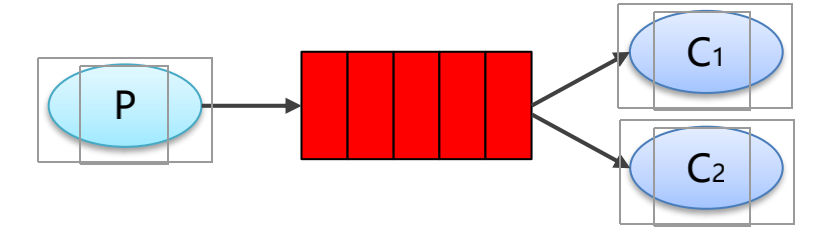


#### 4.1.2 实现步骤

**生产者**

```java
package cn.wolfcode.java.rabbitmq._02worker;
import com.rabbitmq.client.Channel;
import com.rabbitmq.client.Connection;
import com.rabbitmq.client.ConnectionFactory;
import com.rabbitmq.client.MessageProperties;

/**
 * Created by wolfcode-fanjialong
 */

public class NewTask {
    private static final String TASK_QUEUE_NAME = "task_queue";
    public static void main(String[] argv) throws Exception {
        ConnectionFactory factory = new ConnectionFactory();
        factory.setHost("192.168.142.129");
        try (Connection connection = factory.newConnection();
             Channel channel = connection.createChannel()) {
            channel.queueDeclare(TASK_QUEUE_NAME, true, false, false, null);
            String message = "tasequeue";
            for(int i=0;i<20;i++){
                channel.basicPublish("", TASK_QUEUE_NAME,
                        MessageProperties.PERSISTENT_TEXT_PLAIN,

                        (message+i).getBytes("UTF-8"));

            }
            System.out.println(" [x] Sent '" + message + "'");
        }
    }
}
```

**消费者**

```java
package cn.wolfcode.java.rabbitmq._02worker;

import com.rabbitmq.client.Channel;
import com.rabbitmq.client.Connection;
import com.rabbitmq.client.ConnectionFactory;
import com.rabbitmq.client.DeliverCallback;
import java.util.concurrent.TimeUnit;

/**

 * Created by wolfcode-fanjialong

 */

public class Worker {

    private static final String TASK_QUEUE_NAME = "task_queue";

    public static void main(String[] argv) throws Exception {
        ConnectionFactory factory = new ConnectionFactory();
        factory.setHost("192.168.142.129");
        final Connection connection = factory.newConnection;
        final Channel channel = connection.createChannel();
        channel.queueDeclare(TASK_QUEUE_NAME, true, false, false, null);
        System.out.println(" [*] Waiting for messages. To exit press CTRL+C");
        //channel.basicQos(1);
        DeliverCallback deliverCallback = (consumerTag, delivery) -> {
            String message = new String(delivery.getBody(), "UTF-8");
            try {
                TimeUnit.SECONDS.sleep(1);
            } catch (InterruptedException e) {
                e.printStackTrace();
            }finally {
                channel.basicAck(delivery.getEnvelope().getDeliveryTag(), false);
            }

            System.out.println(" [x] Received '" + message + "'");
        };

        channel.basicConsume(TASK_QUEUE_NAME, false, deliverCallback, consumerTag -> { });
    }

}
```

#### **4.1.3 简单问题说明** 

从结果可以看出消息被平均分配到两个消费方，来对消息进行处理，提高了消息处理效率，创建多个消费者来对消息进行处理。这里RabitMQ采用轮询来对消息进行分发时保证了消息被平均分配到每个消费方  。

但是引入新的问题:真正的生产环境下，对于消息的处理基本不会像我们现在看到的这样，每个消 费方处理的消息数量是平均分配的，比如因为网络原因，机器cpu ，内存等硬问题，消费方处理消息时 同类消息不同机器进行处理时消耗时间也是不一样的，比如1号消费者消费1条消息时1秒，2号消费者消费1条消息是5秒，对于1号消费者比2号消费者处理消息快，那么在分配消息时就应该让1号消费者多收 到消息进行处理，也即是我们通常所说的”能者多劳”,同样Rabbitmq对于这种消息分配模式提供了支持。 

问题： 任务量很大，消息虽然得到了及时的消费，单位时间内消息处理速度加快，提高了吞吐量，可 是不同消费者处理消息的时间不同，导致部分消费者的资源被浪费。 

**解决：采用消息公平分发。** 

总结：工作队列消息轮询分发消费者收到的消息数量平均分配，单位时间内消息处理速度加快，提高了吞吐量。


#### **4.4 工作模式队列-消息公平分发(fair dispatch)**

在案例01中对于**消息分发采用的是默认轮询分发，消息应答采用的自动应答模式**，这是因为当消息进 入队列，RabbitMQ就会分派消息。它不看消费者为应答的数目，只是盲目的将第n条消息发给第n个消费者。 

为了解决这个问题，我们使用 basicQos(prefetchCount = 1) 方法，来限RabbitMQ只发不超过1条的消息给同一个消费者。当消息处理完毕后，有了反馈，才会进行第二次发送。执行模型图如下:


### 4.2 **Pub/Sub 订阅模式** 

#### **4.2.1. 模式说明**

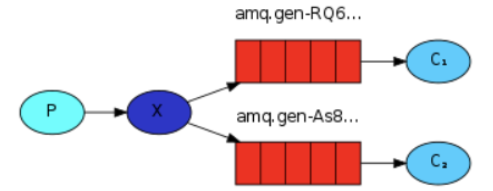

在订阅模型中，多了一个 Exchange 角色，而且过程略有变化： 

 **P**：生产者，也就是要发送消息的程序，但是不再发送到队列中，而是发给X（交换机） 

**C**：消费者，消息的接收者，会一直等待消息到来 

**Queue**：消息队列，接收消息、缓存消息 

 **Exchange**：交换机（X）。一方面，接收生产者发送的消息。另一方面，知道如何处理消息，例如递交给某个特别队列、 

递交给所有队列、或是将消息丢弃。到底如何操作，取决于Exchange的类型。Exchange有常见以下3种类型： 

➢ **Fanout**：广播，将消息交给所有绑定到交换机的队列 

➢ **Direct**：定向，把消息交给符合指定routing key 的队列 

➢ **Topic**：通配符，把消息交给符合routing pattern（路由模式） 的队列 

**Exchange**（交换机）只负责转发消息，不具备存储消息的能力，因此如果没有任何队列与 Exchange 绑定，或者没有符合路由规则的队列，那么消息会丢失！

#### 4.2.2 实现步骤

**生产者**

```java
package cn.wolfcode.java.rabbitmq._03pubsub;
import com.rabbitmq.client.Channel;
import com.rabbitmq.client.Connection;
import com.rabbitmq.client.ConnectionFactory;

/**
 * Created by wolfcode-fanjialong
 */
public class EmitLog {
    private static final String EXCHANGE_NAME = "logs";
    public static void main(String[] argv) throws Exception {
        ConnectionFactory factory = new ConnectionFactory();
        factory.setHost("localhost");
        try (Connection connection = factory.newConnection();
            Channel channel = connection.createChannel()) {
            channel.exchangeDeclare(EXCHANGE_NAME, "fanout");
            String message = "info: Hello World!";
            channel.basicPublish(EXCHANGE_NAME, "", null, message.getBytes("UTF-8"));
            System.out.println(" [x] Sent '" + message + "'");
        }
    }
}
```

**消费者**

```java
package cn.wolfcode.java.rabbitmq._03pubsub;

import com.rabbitmq.client.Channel;
import com.rabbitmq.client.Connection;
import com.rabbitmq.client.ConnectionFactory;
import com.rabbitmq.client.DeliverCallback;

/**
 * Created by wolfcode-fanjialong
 */

public class ReceiveLogs {
    private static final String EXCHANGE_NAME = "logs";
    public static void main(String[] argv) throws Exception {
        ConnectionFactory factory = new ConnectionFactory();
        factory.setHost("localhost");
        Connection connection = factory.newConnection();
        Channel channel = connection.createChannel();
        channel.exchangeDeclare(EXCHANGE_NAME, "fanout");
        String queueName = channel.queueDeclare().getQueue();
        channel.queueBind(queueName, EXCHANGE_NAME, "");
        System.out.println(" [*] Waiting for messages. To exit press CTRL+C");
        DeliverCallback deliverCallback = (consumerTag, delivery) -> {
            String message = new String(delivery.getBody(), "UTF-8");
            System.out.println(" [x] Received '" + message + "'");
        };
        channel.basicConsume(queueName, true, deliverCallback, consumerTag -> { });
    }
}
```

### 4.3  Routing 路由模式

#### 4.3.1 模式说明

队列与交换机的绑定，不能是任意绑定了，而是要指定一个 RoutingKey（路由key） 

消息的发送方在向 Exchange 发送消息时，也必须指定消息的 RoutingKey 

Exchange 不再把消息交给每一个绑定的队列，而是根据消息的 Routing Key 进行判断，只有队列的 Routingkey 与消息的 Routing key 完全一致，才会接收到消息

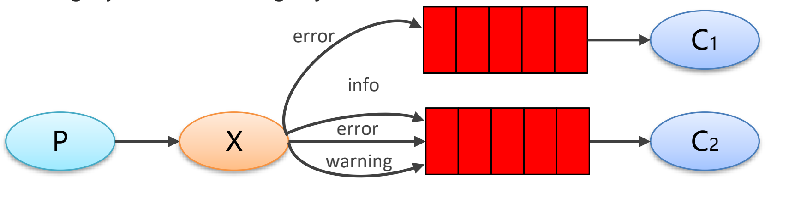

有路由key

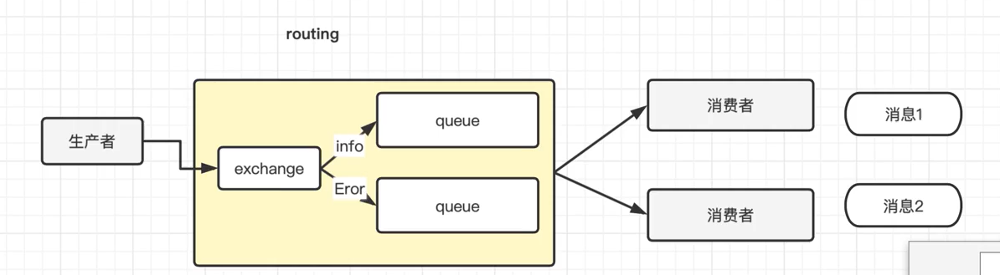

**图解**： 

 P：生产者，向 Exchange 发送消息，发送消息时，会指定一个routing key 

 X：Exchange（交换机），接收生产者的消息，然后把消息递交给与 routing key 完全匹配的队列 

 C1：消费者，其所在队列指定了需要 routing key 为 error 的消息 

 C2：消费者，其所在队列指定了需要 routing key 为 info、error、warning 的消息 

#### 4.3.2 实现步骤

**生产者**

```java
package cn.wolfcode.java.rabbitmq._04rounting;
import com.rabbitmq.client.BuiltinExchangeType;
import com.rabbitmq.client.Channel;
import com.rabbitmq.client.Connection;
import com.rabbitmq.client.ConnectionFactory;
/**
 * Created by wolfcode-fanjialong
 */

public class EmitLogDirect {
    private static final String EXCHANGE_NAME = "direct_logs";
    public static void main(String[] argv) throws Exception {
        ConnectionFactory factory = new ConnectionFactory();
        factory.setHost("localhost");
        try (Connection connection = factory.newConnection();
             Channel channel = connection.createChannel()) {
            channel.exchangeDeclare(EXCHANGE_NAME, BuiltinExchangeType.DIRECT);
            String severity = "info";
            String message = "directMsg";
            channel.basicPublish(EXCHANGE_NAME, severity, null, message.getBytes("UTF-8"));
            System.out.println(" [x] Sent '" + severity + "':'" + message + "'");
        }
    }
}
```

**消费者**

```java
package cn.wolfcode.java.rabbitmq._04rounting;

import com.rabbitmq.client.*;

/**

 * Created by wolfcode-fanjialong

 */

public class ReceiveLogsDirect {
    private static final String EXCHANGE_NAME = "direct_logs";
    public static void main(String[] argv) throws Exception {
        ConnectionFactory factory = new ConnectionFactory();
        factory.setHost("localhost");
        Connection connection = factory.newConnection();
        Channel channel = connection.createChannel();
        channel.exchangeDeclare(EXCHANGE_NAME, BuiltinExchangeType.DIRECT);
        String queueName = channel.queueDeclare().getQueue();
        channel.queueBind(queueName, EXCHANGE_NAME, "info");
        channel.queueBind(queueName, EXCHANGE_NAME, "error");
        channel.queueBind(queueName, EXCHANGE_NAME, "warning");
        System.out.println(" [*] Waiting for messages. To exit press CTRL+C");
        DeliverCallback deliverCallback = (consumerTag, delivery) -> {
            String message = new String(delivery.getBody(), "UTF-8");
            System.out.println(" [x] Received '" + delivery.getEnvelope().getRoutingKey() + "':'" + message + "'");
        };
        channel.basicConsume(queueName, true, deliverCallback, consumerTag -> {
        });
    }

}
```

### 4.4 Topic 模式

#### 4.4.1 模式介绍

**Topic** 类型与 **Direct** 相比，都是可以根据 RoutingKey 把消息路由到不同的队列。只不过 Topic 类型 

**Exchange** 可以让队列在绑定 Routing key 的时候使用**通配符**！ 

**Routingkey** 一般都是有一个或多个单词组成，多个单词之间以”.”分割，例如： item.insert  

**通配符规则**：# 匹配一个或多个词，* 匹配不多不少恰好1个词，例如：item.# 能够匹配 item.insert.abc 或者 item.insert，item.* 只能匹配 item.insert

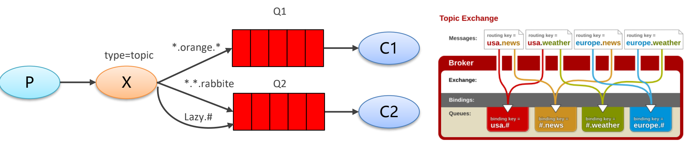


图解： 

 红色 Queue：绑定的是 usa.# ，因此凡是以 usa. 开头的 routing key 都会被匹配到 

 黄色 Queue：绑定的是 #.news ，因此凡是以 .news 结尾的 routing key 都会被匹配

#### 4.4.2 实现步骤

**生产者**

```java
package cn.wolfcode.java.rabbitmq._05topic;

import com.rabbitmq.client.Channel;
import com.rabbitmq.client.Connection;
import com.rabbitmq.client.ConnectionFactory;

/**

 * Created by wolfcode-fanjialong

 */

public class EmitLogTopic {

    private static final String EXCHANGE_NAME = "topic_logs";
    public static void main(String[] argv) throws Exception {
        ConnectionFactory factory = new ConnectionFactory();
        factory.setHost("localhost");
        try (Connection connection = factory.newConnection();
             Channel channel = connection.createChannel()) {
            channel.exchangeDeclare(EXCHANGE_NAME, "topic");
            String routingKey = "order1.save";
            String message = "topicMsg";
            channel.basicPublish(EXCHANGE_NAME, routingKey, null, message.getBytes("UTF-8"));
            System.out.println(" [x] Sent '" + routingKey + "':'" + message + "'");
        }

    }

}
```

**消费者**

```java
package cn.wolfcode.java.rabbitmq._05topic;

import com.rabbitmq.client.Channel;
import com.rabbitmq.client.Connection;
import com.rabbitmq.client.ConnectionFactory;
import com.rabbitmq.client.DeliverCallback;

/**

 * Created by wolfcode-fanjialong

 */

public class ReceiveLogsTopic {

    private static final String EXCHANGE_NAME = "topic_logs";

    public static void main(String[] argv) throws Exception {
        ConnectionFactory factory = new ConnectionFactory();
        factory.setHost("localhost");
        Connection connection = factory.newConnection();
        Channel channel = connection.createChannel();
        channel.exchangeDeclare(EXCHANGE_NAME, "topic");
        String queueName = channel.queueDeclare().getQueue();
        channel.queueBind(queueName, EXCHANGE_NAME, "order.*");
        System.out.println(" [*] Waiting for messages. To exit press CTRL+C");
        DeliverCallback deliverCallback = (consumerTag, delivery) -> {
            String message = new String(delivery.getBody(), "UTF-8");
            System.out.println(" [x] Received '" + delivery.getEnvelope().getRoutingKey() + "':'" + message + "'");
        };

        channel.basicConsume(queueName, true, deliverCallback, consumerTag -> { });

    }

}
```

### ==4.5 工作模式总结==

**1、简单模式 HelloWorld** 

一个生产者、一个消费者，不需要设置交换机（使用默认的交换机）。 

**2、工作队列模式 Work Queue** 

一个生产者、多个消费者（竞争关系），不需要设置交换机（使用默认的交换机）。 

**3、发布订阅模式 Publish/subscribe** 

需要设置类型为 **fanout** 的交换机 ，并且交换机和队列进行绑定 ，当发送消息到交换机后，交换机会将消 息发送到绑定的队列。 

**4、路由模式 Routing** 

需要设置类型为 **direct** 的交换机 ，交换机和队列进行绑定 ， **并且指定 routing key**，当发送消息到交换机 后 ，交换机会根据 routing key 将消息发送到对应的队列。 

**5、通配符模式 Topic** 

需要设置类型为 **topic** 的交换机 ，交换机和队列进行绑定 ，**并且指定通配符方式的 routing key** ，当发送消息到交换机后 ，交换机会根据 routing key 将消息发送到对应的队列。


## 5、 Springboot环境快速集成RabbitMQ

教程参考： https://blog.csdn.net/AhangA/article/details/121641034?utm_medium=distribute.pc_relevant.none-task-blog-2~default~baidujs_baidulandingword~default-4-121641034-blog-100514134.235^v36^pc_relevant_anti_vip&spm=1001.2101.3001.4242.3&utm_relevant_index=7

https://blog.csdn.net/lsqingfeng/article/details/123652520

看这个： 

https://blog.csdn.net/Listening_Wind/article/details/113358136

https://blog.csdn.net/weixin_44736663/article/details/115479885


生产者

```xml
        <dependency>
            <groupId>org.springframework.boot</groupId>
            <artifactId>spring-boot-starter-amqp</artifactId>
        </dependency>
```


消费者

```xml
 <dependency>
            <groupId>com.rabbitmq</groupId>
            <artifactId>amqp-client</artifactId>
        </dependency>

        <dependency>
            <groupId>org.springframework.boot</groupId>
            <artifactId>spring-boot-starter-amqp</artifactId>
        </dependency>
```


### 5.1 Work模式

**消息分发采用的是默认轮询分发，消息应答采用的自动应答模式**，这是因为当消息进 入队列，RabbitMQ就会分派消息。它不看消费者为应答的数目，只是盲目的将第n条消息发给第n个消费者。 

为了解决这个问题，我们使用 prefetch = 1)方法，来限RabbitMQ只发不超过1条的消息给同一个消费者

实际上这种模式就非常适合多个工人等待新的任务到来的场景，我们的任务有很多个，一个一个丢进消息队列，而此时工人有很多个，那么我们就可以将这些任务分配个各个工人，让他们各自负责一些任务，并且做的快的工人还可以做完成一些（**能者多劳**）。

非常简单，我们只需要创建两个监听器即可：

```java
@Component
public class TestListener {
    @RabbitListener(queues = "yyds")
    public void receiver(String data){   //这里直接接收String类型的数据
        System.out.println("一号消息队列监听器 "+data);
    }

    @RabbitListener(queues = "yyds")
    public void receiver2(String data){
        System.out.println("二号消息队列监听器 "+data);
    }
}
```

可以看到我们发送消息时，会自动进行轮询分发：


那么如果我们一开始就在消息队列中放入一部分消息在开启消费者呢？


可以看到，如果是一开始就存在消息，会被一个消费者一次性全部消耗，这是因为我们没有对消费者的Prefetch count（预获取数量，一次性获取消息的最大数量）进行限制，也就是说我们现在希望的是消费者一次只能拿一个消息，而不是将所有的消息全部都获取。


因此我们需要对这个数量进行一些配置，这里我们需要在配置类中定义一个自定义的ListenerContainerFactory，可以在这里设定消费者Channel的PrefetchCount的大小：

```java
@Resource
private CachingConnectionFactory connectionFactory;

@Bean(name = "listenerContainer")
public SimpleRabbitListenerContainerFactory listenerContainer(){
    SimpleRabbitListenerContainerFactory factory = new SimpleRabbitListenerContainerFactory();
    factory.setConnectionFactory(connectionFactory);
    factory.setPrefetchCount(1);   //将PrefetchCount设定为1表示一次只能取一个
    return factory;
}
```

接着我们在监听器这边指定即可：

```java
@Component
public class TestListener {
    @RabbitListener(queues = "yyds",  containerFactory = "listenerContainer")
    public void receiver(String data){
        System.out.println("一号消息队列监听器 "+data);
    }

    @RabbitListener(queues = "yyds", containerFactory = "listenerContainer")
    public void receiver2(String data){
        System.out.println("二号消息队列监听器 "+data);
    }
}
```

现在我们再次启动服务器，可以看到PrefetchCount被限定为1了：


再次重复上述的实现，可以看到消息不会被一号消费者给全部抢走了：


当然除了去定义两个相同的监听器之外，我们也可以直接在注解中定义，比如我们现在需要10个同样的消费者：

```java
@Component
public class TestListener {
    @RabbitListener(queues = "yyds",  containerFactory = "listenerContainer", concurrency = "10")
    public void receiver(String data){
        System.out.println("一号消息队列监听器 "+data);
    }
}
```

可以看到在管理页面中出现了10个消费者：


至此，有关工作队列模式就讲到这里。


完整配置如下：

**config**

```java

import org.springframework.amqp.core.Queue;
import org.springframework.amqp.rabbit.config.SimpleRabbitListenerContainerFactory;
import org.springframework.amqp.rabbit.connection.CachingConnectionFactory;
import org.springframework.context.annotation.Bean;
import org.springframework.context.annotation.Configuration;


import javax.annotation.Resource;

@Configuration
public class WorkConfig {
    @Resource
    private CachingConnectionFactory connectionFactory;

    @Bean(name = "listenerContainer")
    public SimpleRabbitListenerContainerFactory listenerContainer(){
        SimpleRabbitListenerContainerFactory factory = new SimpleRabbitListenerContainerFactory();
        factory.setConnectionFactory(connectionFactory);
        factory.setPrefetchCount(1);   //将PrefetchCount设定为1表示一次只能取一个
        return factory;
    }

    /**
     * Queue 可以有4个参数
     *      1.name          队列名
     *      2.durable       持久化消息队列 ,rabbitmq重启的时候不需要创建新的队列 默认true
     *      3.auto-delete   表示消息队列没有在使用时将被自动删除 默认是false
     *      4.exclusive     表示该消息队列是否只在当前connection生效,默认是false
     */
    @Bean
    public Queue createWorkQueuesQueue() {
        return new Queue("WorkQueues",true);
    }

}
```


**生产者：**

```java


import lombok.extern.slf4j.Slf4j;
import org.springframework.amqp.rabbit.core.RabbitTemplate;
import org.springframework.web.bind.annotation.GetMapping;
import org.springframework.web.bind.annotation.RequestMapping;
import org.springframework.web.bind.annotation.RestController;

import javax.annotation.Resource;

@RestController
@Slf4j
@RequestMapping("/work")
public class WorkController {
    @Resource
    private RabbitTemplate rabbitTemplate;

    @GetMapping("/send")
    public String sendMessage(){
        for (int i = 0; i < 20; i++) {
            rabbitTemplate.convertAndSend("WorkQueues","work message"+ i);

        }
        return "消息发送成功";
    }
}
```


**消费者**

```java
import org.springframework.amqp.rabbit.annotation.RabbitListener;
import org.springframework.stereotype.Component;

@Component
public class WorkQueueListener {
    @RabbitListener(queues = "WorkQueues", containerFactory = "listenerContainer")
    public void receiver(String data){   //这里直接接收String类型的数据
        System.out.println("一号消息队列监听器 "+data);
    }

    @RabbitListener(queues = "WorkQueues", containerFactory = "listenerContainer")
    public void receiver2(String data){
        try {
            Thread.sleep(1000);
        } catch (InterruptedException e) {
            throw new RuntimeException(e);
        }
        System.out.println("二号消息队列监听器 "+data);
    }
```


### 5.2 Pub/Sub模式 --fanout

➢ **Fanout**：广播，将消息交给所有绑定到交换机的队列 

➢ **Direct**：定向，把消息交给符合指定routing key 的队列 

➢ **Topic**：通配符，把消息交给符合routing pattern（路由模式） 的队列 


==*fanout类型交换机在于队列绑定时不需要指定routingKey*==


config

```java


import org.springframework.amqp.core.Binding;
import org.springframework.amqp.core.BindingBuilder;
import org.springframework.amqp.core.FanoutExchange;
import org.springframework.amqp.core.Queue;
import org.springframework.context.annotation.Bean;
import org.springframework.context.annotation.Configuration;

@Configuration
public class FanoutExchangeConfig {
 
    public static final String FANOUT_QUEUE = "fanoutQueue";
    public static final String FANOUT_QUEUE2 = "fanoutQueue2";
    public static final String FANOUT_QUEUE3 = "fanoutQueue3";
    public static final String FANOUT_EXCHANGE = "fanoutExchange";
    // fanout它不需要绑定routingkey
    public static final String FANOUT_ROUTING_KEY = "fanout";
 
    @Bean
    public Queue fanoutQueue() {
        return new Queue(FANOUT_QUEUE, true);
    }
 
    @Bean
    public Queue fanoutQueue2() {
        return new Queue(FANOUT_QUEUE2, true);
    }
 
    @Bean
    public FanoutExchange fanoutExchange() {
        return new FanoutExchange(FANOUT_EXCHANGE, true, false);
    }
 
    @Bean
    public Binding bindingFanoutExchange(Queue fanoutQueue, FanoutExchange fanoutExchange) {
        return BindingBuilder.bind(fanoutQueue).to(fanoutExchange);
    }
 
    @Bean
    public Binding bindingFanoutExchange2(Queue fanoutQueue2, FanoutExchange fanoutExchange) {
        return BindingBuilder.bind(fanoutQueue2).to(fanoutExchange);
    }
}
```

**生产者：**

```java

import com.rabbitmq.config.FanoutExchangeConfig;
import lombok.extern.slf4j.Slf4j;
import org.springframework.amqp.rabbit.core.RabbitTemplate;
import org.springframework.web.bind.annotation.GetMapping;
import org.springframework.web.bind.annotation.RequestMapping;
import org.springframework.web.bind.annotation.RestController;

import javax.annotation.Resource;

@RestController
@Slf4j
@RequestMapping("/fanout")
public class FanoutController {

    @Resource
    private  RabbitTemplate rabbitTemplate;

 
    /**
     * fanout交换机为扇形模式交换机
     *  消息会发送到所有绑定的队列上。
     * @return
     */
    @GetMapping("send")
    public String sendMsg() {
        rabbitTemplate.convertAndSend(FanoutExchangeConfig.FANOUT_EXCHANGE, null, "发送一条测试消息：fanout");
        return "fanout消息发送成功！！";
    }
}
```

**消费者：**

```java


import com.rabbitmq.config.FanoutExchangeConfig;
import lombok.extern.slf4j.Slf4j;
import org.springframework.amqp.rabbit.annotation.RabbitHandler;
import org.springframework.amqp.rabbit.annotation.RabbitListener;
import org.springframework.stereotype.Component;

@Slf4j
@Component
public class FanoutQueueListener {
 
    /**
     * fanout交换机： 扇型交换机，这个交换机没有路由键概念，就算你绑了路由键也是无视的。 这个交换机在接收到消息后，会直接转发到绑定到它上面的所有队列
     * 同一个队列监听多次，只会消费一次。
     * 交换机绑定的多个队列都可以收到消息
     * @param testMessage
     */
    @RabbitHandler
    @RabbitListener(queues = FanoutExchangeConfig.FANOUT_QUEUE)
    public void process(String testMessage) {
        System.out.println("FanoutReceiver消费者收到消息1  : " + testMessage);
    }

 
    @RabbitHandler
    @RabbitListener(queues = FanoutExchangeConfig.FANOUT_QUEUE2)
    public void process2(String testMessage) {
        System.out.println("FanoutReceiver消费者收到消息2  : " + testMessage);
    }
 
}
```


### 5.3 Routing模式 --direct

➢ **Fanout**：广播，将消息交给所有绑定到交换机的队列 

➢ **Direct**：定向，把消息交给符合指定routing key 的队列 

➢ **Topic**：通配符，把消息交给符合routing pattern（路由模式） 的队列 

==*direct类型交换机在于队列绑定时不需要指定routingKey*==

教程链接 ： https://blog.csdn.net/qq_35387940/article/details/100514134

官方文档：https://docs.spring.io/spring-amqp/docs/current/reference/html/

前面我们已经完成了RabbitMQ的安装和简单使用，并且通过Java连接到服务器。现在我们来尝试在SpringBoot中整合消息队列客户端，首先是依赖：

```xml
<dependency>
    <groupId>org.springframework.boot</groupId>
    <artifactId>spring-boot-starter-amqp</artifactId>
</dependency>
```

接着我们需要配置RabbitMQ的地址等信息：

```yaml
spring:
  rabbitmq:
    addresses: 192.168.0.4
    username: guest
    password: guest
    virtual-host: test
```

这样我们就完成了最基本信息配置，现在我们来看一下，如何像之前一样去声明一个消息队列，我们只需要一个配置类就行了：

**生产者**

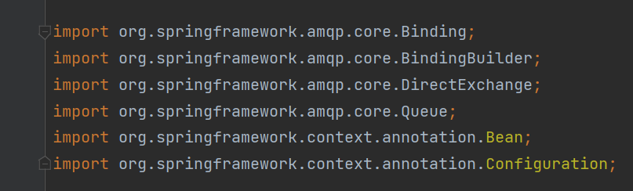

```java
@Configuration
public class RabbitConfiguration {
    @Bean("directExchange")  //定义交换机Bean，可以很多个
    public Exchange exchange(){
        return ExchangeBuilder.directExchange("amq.direct").build();
    }

    @Bean("yydsQueue")     //定义消息队列
    public Queue queue(){
        return QueueBuilder
          				.nonDurable("yyds")   //非持久化类型
          				.build();
    }

    @Bean("binding")
    public Binding binding(@Qualifier("directExchange") Exchange exchange,
                           @Qualifier("yydsQueue") Queue queue){
      	//将我们刚刚定义的交换机和队列进行绑定
        return BindingBuilder
                .bind(queue)   //绑定队列
                .to(exchange)  //到交换机
                .with("my-yyds")   //使用自定义的routingKey
                .noargs();
    }
}
```


或者使用这种方式配置

```java
package com.rabbitmq.config;

import org.springframework.amqp.core.Binding;
import org.springframework.amqp.core.BindingBuilder;
import org.springframework.amqp.core.DirectExchange;
import org.springframework.amqp.core.Queue;
import org.springframework.context.annotation.Bean;
import org.springframework.context.annotation.Configuration;

@Configuration
public class DirectExchangeConfig {
    /**
     * 这里我们创建了一个叫directExchange的交换机，绑定了directQueue和directQueue2两个队列，路由键是direct.
     *
     * 消息的生产者，我们通过一个Controller来进行模拟,直接引用rabbitTemplate
     */
 
    public static final String DIRECT_QUEUE = "directQueue";
    public static final String DIRECT_QUEUE2 = "directQueue2";
    public static final String DIRECT_EXCHANGE = "directExchange";
    public static final String DIRECT_ROUTING_KEY = "direct";

    //队列，取别名 directQueue
    @Bean
    public Queue directQueue() {
        return new Queue(DIRECT_QUEUE, true);
    }
 
    @Bean
    public Queue directQueue2() {
        return new Queue(DIRECT_QUEUE2, true);
    }
 
    @Bean
    public DirectExchange directExchange() {
        return new DirectExchange(DIRECT_EXCHANGE, true, false);
    }

    // 将队列和交换机绑定
    @Bean
    public Binding bindingDirectExchange(Queue directQueue, DirectExchange directExchange) {
        return BindingBuilder.bind(directQueue).to(directExchange).with(DIRECT_ROUTING_KEY);
    }
 
    @Bean
    public Binding bindingDirectExchange2(Queue directQueue2, DirectExchange directExchange) {
        return BindingBuilder.bind(directQueue2).to(directExchange).with(DIRECT_ROUTING_KEY);
    }
 
}
```


接着我们来创建一个生产者，这里我们直接编写在测试用例中：

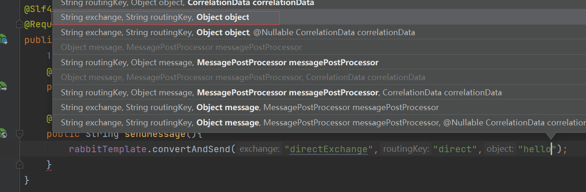

```java
@SpringBootTest
class SpringCloudMqApplicationTests {

  	//RabbitTemplate为我们封装了大量的RabbitMQ操作，已经由Starter提供，因此直接注入使用即可
    @Resource
    RabbitTemplate template;

    @Test
    void publisher() {
      	//使用convertAndSend方法一步到位，参数基本和之前是一样的
      	//最后一个消息本体可以是Object类型，真是大大的方便
        template.convertAndSend("amq.direct", "my-yyds", "Hello World!");
    }

}
```


**消费者**


```xml
<dependency>
    <groupId>com.rabbitmq</groupId>
    <artifactId>amqp-client</artifactId>
</dependency>

<dependency>
    <groupId>org.springframework.boot</groupId>
    <artifactId>spring-boot-starter-amqp</artifactId>
</dependency>
```


**@RabbitListener和@RabbitHandler的使用**

https://blog.csdn.net/sliver1836/article/details/119734239

```java
import org.springframework.amqp.rabbit.annotation.RabbitListener;
import org.springframework.stereotype.Component;

@Component
public class DirectReceiver {
    @RabbitListener(queues = {"directQueue2"})
    public void process(String message){
        System.out.println("接收到的消息为："+ message);
    }
}

```


### 5.4 Topic模式 --topic

➢ **Fanout**：广播，将消息交给所有绑定到交换机的队列 

➢ **Direct**：定向，把消息交给符合指定routing key 的队列 

➢ **Topic**：通配符，把消息交给符合routing pattern（路由模式） 的队列 


主题交换机，会根据routing-Key的匹配规则，将消息发送到符合规则的队列中。


**config**

```java


import org.springframework.amqp.core.Binding;
import org.springframework.amqp.core.BindingBuilder;
import org.springframework.amqp.core.Queue;
import org.springframework.amqp.core.TopicExchange;
import org.springframework.context.annotation.Bean;
import org.springframework.context.annotation.Configuration;

/**
 * @className: TopicExchangeConfig
 * @description:
 * *  (星号) 用来表示一个单词 (必须出现的)
 * #  (井号) 用来表示任意数量（零个或多个）单词
 */
@Configuration
public class TopicExchangeConfig {
 
    public static final String TOPIC_QUEUE = "topicQueue";
    public static final String TOPIC_QUEUE2 = "topicQueue2";
    public static final String TOPIC_QUEUE3 = "topicQueue3";
    public static final String TOPIC_EXCHANGE = "topicExchange";
    public static final String TOPIC_ROUTING_KEY = "topic*";
 
    @Bean
    public Queue topicQueue() {
        return new Queue(TOPIC_QUEUE, true);
    }
 
    @Bean
    public Queue topicQueue2() {
        return new Queue(TOPIC_QUEUE2, true);
    }
 
    @Bean
    public Queue topicQueue3() {
        return new Queue(TOPIC_QUEUE3, true);
    }
 
    @Bean
    public TopicExchange topicExchange() {
        return new TopicExchange(TOPIC_EXCHANGE, true, false);
    }
 
    @Bean
    public Binding bindingTopicExchange(Queue topicQueue, TopicExchange topicExchange) {
        return BindingBuilder.bind(topicQueue).to(topicExchange).with("topic.#");
    }
 
    @Bean
    public Binding bindingTopicExchange2(Queue topicQueue2, TopicExchange topicExchange) {
        return BindingBuilder
                .bind(topicQueue2)
                .to(topicExchange)
                .with("test.#");
    }
 
    @Bean
    public Binding bindingTopicExchange3(Queue topicQueue3, TopicExchange topicExchange) {
        return BindingBuilder
                .bind(topicQueue3)
                .to(topicExchange)
                .with("#");
    }
}
```


**生产者**

```java


import com.rabbitmq.config.TopicExchangeConfig;
import lombok.extern.slf4j.Slf4j;
import org.springframework.amqp.rabbit.core.RabbitTemplate;
import org.springframework.web.bind.annotation.GetMapping;
import org.springframework.web.bind.annotation.RequestMapping;
import org.springframework.web.bind.annotation.RestController;

import javax.annotation.Resource;

@RestController
@Slf4j
@RequestMapping("/topic")
public class TopicController {

    @Resource
    private RabbitTemplate rabbitTemplate;

 
    @GetMapping("send")
    public Object sendMsg(String routingKey) {
        rabbitTemplate.convertAndSend(TopicExchangeConfig.TOPIC_EXCHANGE, routingKey, "发送一条测试消息：topic");
        return "topic消息发送成功！！";
    }
}
```

**消费者：**

```java


import com.rabbitmq.config.TopicExchangeConfig;
import lombok.extern.slf4j.Slf4j;
import org.springframework.amqp.rabbit.annotation.RabbitHandler;
import org.springframework.amqp.rabbit.annotation.RabbitListener;
import org.springframework.stereotype.Component;

/**
 * @className: TopicQueueListener
 * @description: 主题交换机的监听器

 */
@Slf4j
@Component
public class TopicQueueListener {
 
    /**
     * topic: 主题交换机
     * @param testMessage
     */
    @RabbitHandler
    @RabbitListener(queues = TopicExchangeConfig.TOPIC_QUEUE)
    public void process(String testMessage) {
        System.out.println("TopicReceiver消费者收到消息1  : " + testMessage);
    }

    /*消费者1.2会轮流消费*/
    @RabbitHandler
    @RabbitListener(queues = TopicExchangeConfig.TOPIC_QUEUE)
    public void process2(String testMessage) {
        System.out.println("TopicReceiver消费者收到消息2  : " + testMessage);
    }
 
    @RabbitHandler
    @RabbitListener(queues = TopicExchangeConfig.TOPIC_QUEUE2)
    public void process3(String testMessage) {
        System.out.println("TopicReceiver消费者收到消息3  : " + testMessage);
    }

    /*匹配所有*/
    @RabbitHandler
    @RabbitListener(queues = TopicExchangeConfig.TOPIC_QUEUE3)
    public void process4(String testMessage) {
        System.out.println("TopicReceiver消费者收到消息4  : " + testMessage);
    }
 
}
```

## 6 、 RabbitMQ实战案例

### 6.1  案例一 - 退款加积分

需求： 用户进行下单操作 ， 下完单以后要进行加积分操作， 要求下完单以后加积分采用RabbitMQ 进行加积分

**案例分析：**

1 : 下完单以后把数据封装成消息利用生产者发送消息到RabbitMQ中。

2：在积分服务编写消费者实时监听RabbitMQ队列中消息，监听到取出消息消费加积分。

**没有RabbitMQ之前**

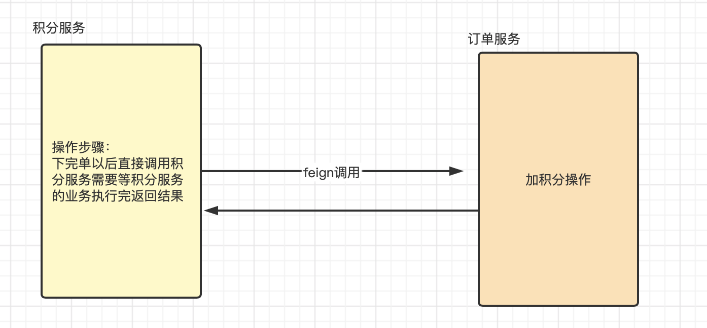

**有了RabbitMQ以后**

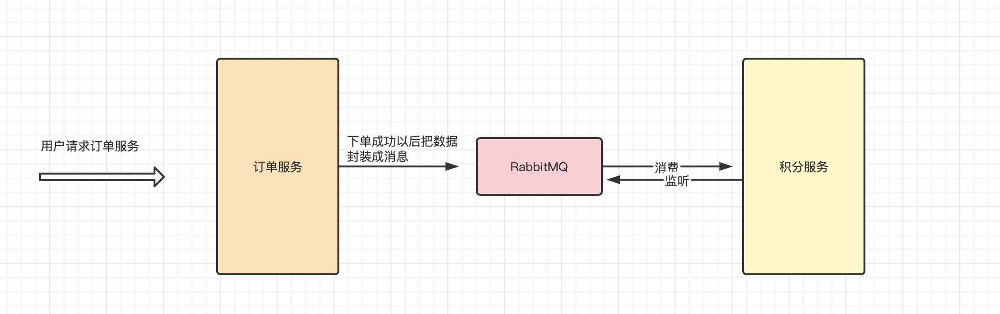

代码实现

### 6.2 案例二 -  秒杀下单操作

需求： 电商平台进行秒杀活动，用户点击下单秒杀商品进行下单，要求用RabbitMQ进行削峰填谷。


**有了RabbitMQ以后**

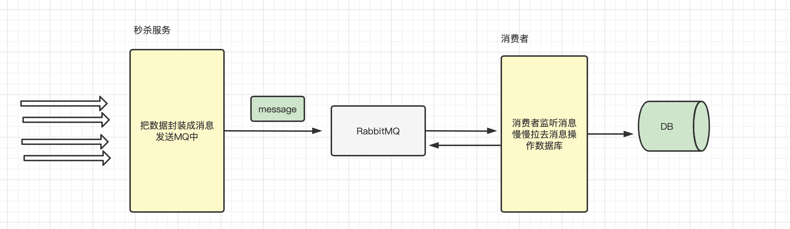

代码实现

## 7、 RabbitMQ高频面试题

### 7.1 RabbitMQ如果出现消息重复消费怎么解决

采用幂等性解决：幂等性指一次和多次请求某一个资源，对于资源本身应该具有同样的结果。也就是说，其任意多次执行对资源本身所产生的影响均与一次执行的影响相同。 

在MQ中指，消费多条相同的消息，得到与消费该消息一次相同的结果。

### 7.2 RabbitMQ中的死信队列

死信队列，英文缩写：DLX 。Dead Letter Exchange（死信交换机），当消息成为Dead message后，可以被重新发送到另一个交换机，这个交换机就是DLX。

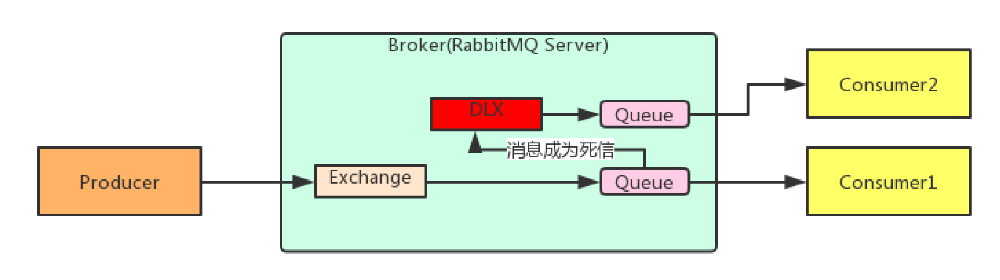

**消息成为死信的三种情况：** 

1. 队列消息长度到达限制； 

2. 消费者拒接消费消息，basicNack/basicReject,并且不把消息重新放入原目标队列,requeue=false； 

3. 原队列存在消息过期设置，消息到达超时时间未被消费；

### 7.3 RabbitMQ 怎么实现消息可靠性   

#### **7.3.1 生产者投递可靠性**

**技术博客：** https://mp.weixin.qq.com/s/ysAecrYJUowuWRUGZYN0fw

在使用 RabbitMQ 的时候，作为消息发送方希望杜绝任何消息丢失或者投递失败场景。RabbitMQ 为我们提供了两种方式用来控制消息的投递可靠性模式。 

 confirm 确认模式 

 return 退回模式 


rabbitmq 整个消息投递的路径为： 

producer--->rabbitmq broker--->exchange--->queue--->consumer 消息从 producer 到 exchange 则会返回一个 confirmCallback 。 消息从 exchange-->queue 投递失败则会返回一个 returnCallback 。 

我们将利用这两个 callback 控制消息的可靠性投递


**开启Confirm模式后，RabbitMQ在发送消息后会等待Broker返回确认信号，确认信号包括basic.ack和basic.nack两种。如果Broker成功接收到消息并持久化到磁盘中，就会发送basic.ack确认信号给生产者，生产者就会知道消息已经成功发送；如果Broker无法处理消息，就会发送basic.nack确认信号给生产者，生产者就会知道消息发送失败。**

**因此，开启Confirm模式可以保证消息投递的可靠性。如果消息在发送过程中出现错误，生产者就会收到basic.nack确认信号，然后可以选择重新发送消息或者进行其他处理。**

**如果消息已经成功发送到Broker，但是在消费者消费消息的过程中出现了错误，RabbitMQ提供了死信队列（Dead-Letter Exchange，DLX）来处理这种情况。消费者在消费消息时可以将消费失败的消息发送到DLX中，然后由DLX进行处理。DLX可以将消息重新发送到原来的队列中，或者将消息发送到其他队列中进行处理。这样就可以保证消息不会丢失，同时也可以提高系统的可靠性。**


`**returnCallback` 模式是 RabbitMQ 提供的一种消息发送可靠性机制。当消息无法路由到目标队列时，RabbitMQ 会将该消息返回给生产者。这个机制可以保证消息发送的可靠性，避免消息发送到黑洞。**

**使用该模式时，需要先开启 `mandatory` 参数，将消息发送到一个不存在的队列或者路由键无法匹配时，RabbitMQ 会将消息返回给生产者，并触发 `returnCallback` 回调函数。**

**当消息被返回时，可以在 `returnCallback` 回调函数中进行处理，例如重新发送消息或者将消息记录到日志中等。**

**需要注意的是，开启 `returnCallback` 模式并不能保证消息一定会被成功路由到目标队列，但可以保证将无法路由的消息返回给生产者，使得消息发送变得更加可靠。**


#### **7.3.2 消费者投递可靠性**

ack指Acknowledge，确认。 表示消费端收到消息后的确认方式。 

**有三种确认方式：** 

• 自动确认：acknowledge="none" 

• 手动确认：acknowledge="manual" 

• 根据异常情况确认：acknowledge="auto"，（这种方式使用麻烦，不作讲解）

 

其中自动确认是指，当消息一旦被Consumer接收到，则自动确认收到，并将相应 message 从 RabbitMQ 的消息缓存中移除。但是在实际业务处理中，很可能消息接收到，业务处理出现异常，那么该消息就会丢失。如果设置了手动确认方式，则需要在业务处理成功后，调用channel.basicAck()，手动签收，如果出现异常，则调用channel.basicNack()方法，让其自动重新发送消息。


#### 7.3.3 代码编写

rabbitmq消息投递路径

> 生产者->交换机->队列->消费者

总的来说分为三个阶段。

- 1.生产者保证消息投递可靠性。
- 2.mq内部消息不丢失。
- 3.消费者消费成功。

简单点说就是消息百分百发送到消息队列中。
我们可以开启confirmCallback
生产者投递消息后，mq会给生产者一个ack.根据ack,生产者就可以确认这条消息是否发送到mq.

开启confirmCallback
修改配置文件

```yaml
#NONE：禁用发布确认模式，是默认值，CORRELATED：发布消息成功到交换器后会触发回调方法
spring:
  rabbitmq:
    publisher-confirm-type: correlated
```

测试代码

```java
@Test  
public void testConfirmCallback() throws InterruptedException {  
    rabbitTemplate.setConfirmCallback(new RabbitTemplate.ConfirmCallback() {  
    /**  
    *  
    * @param correlationData 配置  
    * @param ack 交换机是否收到消息，true是成功，false是失败  
    * @param cause 失败的原因  
    */  
    @Override  
    public void confirm(CorrelationData correlationData, boolean ack, String cause) {  
        System.out.println("confirm=====>");  
        System.out.println("confirm==== ack="+ack);  
        System.out.println("confirm==== cause="+cause);  
        //根据ACK状态做对应的消息更新操作 TODO  
    }  
    });  
    rabbitTemplate.convertAndSend(RabbitMQConfig.EXCHANGE_NAME,"ikun.mei", "鸡你太美");  
    Thread.sleep(10000);  
}
```

通过returnCallback保证消息从交换器发送到队列成功。 修改配置文件

```yaml
spring:
  rabbitmq:
    #开启returnCallback
    publisher-returns: true
    #交换机处理消息到路由失败，则会返回给生产者
    template:
      mandatory: true
```

测试代码

```java
@Test  
void testReturnCallback() {  
    //为true,则交换机处理消息到路由失败，则会返回给生产者 配置文件指定，则这里不需指定  
    rabbitTemplate.setMandatory(true);  
    //开启强制消息投递（mandatory为设置为true），但消息未被路由至任何一个queue，则回退一条消息  
    rabbitTemplate.setReturnsCallback(returned -> {  
        int code = returned.getReplyCode();  
        System.out.println("code="+code);  
        System.out.println("returned="+ returned);  
    });  
    rabbitTemplate.convertAndSend(RabbitMQConfig.EXCHANGE_NAME,"123456","测试returnCallback");  
}
```

消费者消费消息时需要通过ack手动确认消息已消费。

修改配置文件

```yaml
spring:
  rabbitmq:
    listener:  
      simple:  
        acknowledge-mode: manual
```

编写测试代码

```java
@RabbitHandler  
public void consumer(String body, Message message, Channel channel) throws IOException {  
    long msgTag = message.getMessageProperties().getDeliveryTag();  
    System.out.println("msgTag="+msgTag);  
    System.out.println("message="+ message);  
    System.out.println("body="+body);  

    //成功确认，使用此回执方法后，消息会被 rabbitmq broker 删除  
    channel.basicAck(msgTag,false);  
    // channel.basicNack(msgTag,false,true);  
  
}
```

deliveryTags是消息投递序号，每次消费消息或者消息重新投递后，deliveryTag都会增加


### 7.4  RabbitMQ 如何实现延迟队列

延迟队列，即消息进入队列后不会立即被消费，只有到达指定时间后，才会被消费

需求： 

1. 下单后，30分钟未支付，取消订单，回滚库存。 

2. 新用户注册成功7天后，发送短信问候。 

实现方式： 

1. 定时器 

2. 延迟队列


**使用延时队列实现**

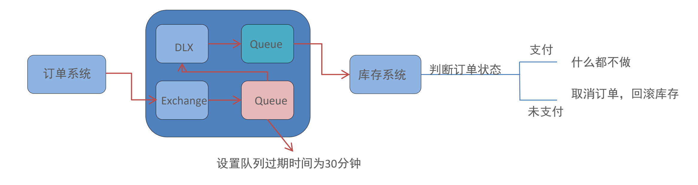

1. 延迟队列 指消息进入队列后，可以被延迟一定时间，再进行消费。 

2. RabbitMQ没有提供延迟队列功能，但是可以使用 ： TTL + DLX 来实现延迟队列效果。


生产者投递到mq中并不希望这条消息立马被消费，而是等待一段时间后再去消费。

springboot整合rabbitmq实现订单超时自动关闭

```java
package com.fandf.test.rabbit;  
  
import org.springframework.amqp.core.*;  
import org.springframework.beans.factory.annotation.Qualifier;  
import org.springframework.context.annotation.Bean;  
import org.springframework.context.annotation.Configuration;  
  
import java.util.HashMap;  
import java.util.Map;  
  
/**  
* @author fandongfeng  
* @date 2023/4/15 15:38  
*/  
@Configuration  
public class RabbitMQConfig {  
  
    /**  
    * 订单交换机  
    */  
    public static final String ORDER_EXCHANGE = "order_exchange";  
    /**  
    * 订单队列  
    */  
    public static final String ORDER_QUEUE = "order_queue";  
    /**  
    * 订单路由key  
    */  
    public static final String ORDER_QUEUE_ROUTING_KEY = "order.#";  

    /**  
    * 死信交换机  
    */  
    public static final String ORDER_DEAD_LETTER_EXCHANGE = "order_dead_letter_exchange";  
    /**  
    * 死信队列 routingKey  
    */  
    public static final String ORDER_DEAD_LETTER_QUEUE_ROUTING_KEY = "order_dead_letter_queue_routing_key";  

    /**  
    * 死信队列  
    */  
    public static final String ORDER_DEAD_LETTER_QUEUE = "order_dead_letter_queue";  


    /**  
    * 创建死信交换机  
    */  
    @Bean("orderDeadLetterExchange")  
    public Exchange orderDeadLetterExchange() {  
        return new TopicExchange(ORDER_DEAD_LETTER_EXCHANGE, true, false);  
    }  

    /**  
    * 创建死信队列  
    */  
    @Bean("orderDeadLetterQueue")  
    public Queue orderDeadLetterQueue() {  
        return QueueBuilder.durable(ORDER_DEAD_LETTER_QUEUE).build();  
    }  

    /**  
    * 绑定死信交换机和死信队列  
    */  
    @Bean("orderDeadLetterBinding")  
    public Binding orderDeadLetterBinding(@Qualifier("orderDeadLetterQueue") Queue queue, @Qualifier("orderDeadLetterExchange")Exchange exchange) {  
        return BindingBuilder.bind(queue).to(exchange).with(ORDER_DEAD_LETTER_QUEUE_ROUTING_KEY).noargs();  
    }  


    /**  
    * 创建订单交换机  
    */  
    @Bean("orderExchange")  
    public Exchange orderExchange() {  
        return new TopicExchange(ORDER_EXCHANGE, true, false);  
    }  

    /**  
    * 创建订单队列  
    */  
    @Bean("orderQueue")  
    public Queue orderQueue() {  
        Map<String, Object> args = new HashMap<>(3);  
        //消息过期后，进入到死信交换机  
        args.put("x-dead-letter-exchange", ORDER_DEAD_LETTER_EXCHANGE);  

        //消息过期后，进入到死信交换机的路由key  
        args.put("x-dead-letter-routing-key", ORDER_DEAD_LETTER_QUEUE_ROUTING_KEY);  

        //过期时间，单位毫秒  
        args.put("x-message-ttl", 10000);  

        return QueueBuilder.durable(ORDER_QUEUE).withArguments(args).build();  
    }  

    /**  
    * 绑定订单交换机和队列  
    */  
    @Bean("orderBinding")  
    public Binding orderBinding(@Qualifier("orderQueue") Queue queue, @Qualifier("orderExchange")Exchange exchange) {  
        return BindingBuilder.bind(queue).to(exchange).with(ORDER_QUEUE_ROUTING_KEY).noargs();  
    }  
  
  
}
```

消费者

```java
package com.fandf.test.rabbit;  
  
import cn.hutool.core.date.DateUtil;  
import com.rabbitmq.client.Channel;  
import org.springframework.amqp.core.Message;  
import org.springframework.amqp.rabbit.annotation.RabbitHandler;  
import org.springframework.amqp.rabbit.annotation.RabbitListener;  
import org.springframework.stereotype.Component;  
  
import java.io.IOException;  
  
/**  
* @author fandongfeng  
* @date 2023/4/15 15:42  
*/  
@Component  
@RabbitListener(queues = RabbitMQConfig.ORDER_DEAD_LETTER_QUEUE)  
public class OrderMQListener {  
  
  
  
    @RabbitHandler  
    public void consumer(String body, Message message, Channel channel) throws IOException {  
        System.out.println("收到消息：" + DateUtil.now());  
        long msgTag = message.getMessageProperties().getDeliveryTag();  
        System.out.println("msgTag=" + msgTag);  
        System.out.println("message=" + message);  
        System.out.println("body=" + body);  
        channel.basicAck(msgTag, false);  
    }  
  
}
```

测试类

```java
@Test  
void testOrder() throws InterruptedException {  
//为true,则交换机处理消息到路由失败，则会返回给生产者 配置文件指定，则这里不需指定  
    rabbitTemplate.setMandatory(true);  
    //开启强制消息投递（mandatory为设置为true），但消息未被路由至任何一个queue，则回退一条消息  
    rabbitTemplate.setReturnsCallback(returned -> {  
    int code = returned.getReplyCode();  
    System.out.println("code=" + code);  
    System.out.println("returned=" + returned);  
    });  
    rabbitTemplate.convertAndSend(RabbitMQConfig.ORDER_EXCHANGE, "order", "测试订单延迟");  
    System.out.println("发送消息：" + DateUtil.now());  
    Thread.sleep(20000);  
}
```

程序输出

```
发送消息：2023-04-16 15:14:34
收到消息：2023-04-16 15:14:44
msgTag=1
message=(Body:'测试订单延迟' MessageProperties [headers={spring_listener_return_correlation=03169cfc-5061-41fe-be47-c98e36d17eac, x-first-death-exchange=order_exchange, x-death=[{reason=expired, count=1, exchange=order_exchange, time=Mon Apr 16 15:14:44 CST 2023, routing-keys=[order], queue=order_queue}], x-first-death-reason=expired, x-first-death-queue=order_queue}, contentType=text/plain, contentEncoding=UTF-8, contentLength=0, receivedDeliveryMode=PERSISTENT, priority=0, redelivered=false, receivedExchange=order_dead_letter_exchange, receivedRoutingKey=order_dead_letter_queue_routing_key, deliveryTag=1, consumerTag=amq.ctag-Eh8GMgrsrAH1rvtGj7ykOQ, consumerQueue=order_dead_letter_queue])
body=测试订单延迟
```